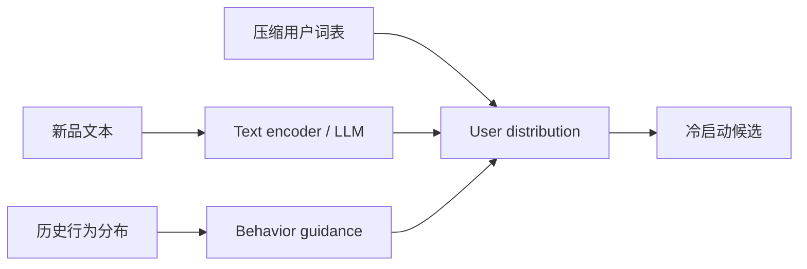
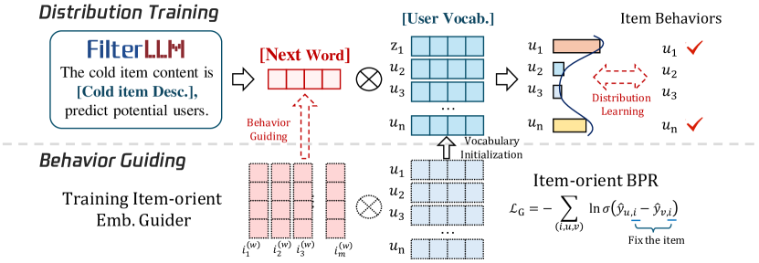

# FilterLLM：从文本直接生成用户分布

> **Fidelity: 核心机制复现**。实际学习文本到压缩用户词表分布，并用行为分布约束冷启动表示。

## 论文信息

| 项目 | 内容 |
| --- | --- |
| 论文链接 | [arXiv 2502.16924](https://arxiv.org/abs/2502.16924) |
| 公司/机构 | Alibaba |
| 首次公开日期 | 2025-02-24（arXiv v1） |
| 原文开源代码 | 否：论文未提供官方/作者代码（核查日期：2026-07-28） |
| Adapter | `filterllm` |
| 本地复现代码 | [`src/auto_research/reproductions/filterllm/`](https://github.com/daiwk/auto-research/tree/main/src/auto_research/reproductions/filterllm/) |

## 原始论文总结

### 背景与主要改动

逐用户判断难以服务十亿用户冷启动。FilterLLM 把商品文本一次映射为用户分布，通过用户词表压缩输出空间，并用历史行为指导分布学习。



<!-- paper-figure:start -->
### 原论文关键图

[](https://ar5iv.labs.arxiv.org/html/2502.16924/assets/x2.png)

> **原论文 Figure 2（关键图）**：展示原论文提出的核心架构、主要模块及其连接关系。图片来自[原论文](https://arxiv.org/abs/2502.16924)，版权归原作者所有；点击图片可查看来源。
<!-- paper-figure:end -->

### 核心公式

$$
p(u\mid x_i)=\operatorname{softmax}(W h(x_i)),\qquad
\mathcal L=-\sum_u q(u\mid i)\log p(u\mid x_i).
$$

### 论文离线与线上效果

论文离线显示 text-to-distribution 在冷启动召回上优于逐用户判断式 LLM；线上相对 ColdLLM：Cold-PV `+5.13%`、PCTR `+3.93%`、GMV `+10.86%`，推理时间 `-97.12%`。

## 本地复现

> **本地对照口径**：相对 content-to-item judgment 基线，实验组 NDCG@10 `-9.82%`。

同一 MovieLens-1M 全目录协议下，NDCG@10 `0.07514→0.06776`（`-9.82%`），Hit@10 `0.14048→0.12619`。这是负结果：genre 文本代理不足以复现工业新品文本收益。指标见 [`metrics/movielens-1m-seed42.json`](metrics/movielens-1m-seed42.json)。

```bash
auto-research reproduce --paper filterllm --dataset-dir data --seed 42
```

## 复现边界

用户词表由公开交互 SVD 压缩，不是十亿用户 LLM token；没有淘宝新品文本、流量和延迟栈。
