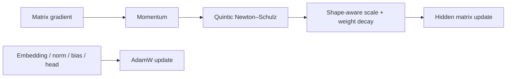

# Muon：面向 LLM 隐藏矩阵的正交化优化器

> **Fidelity: 核心机制复现**。隐藏层二维矩阵使用 Muon，embedding、norm、bias 与输出参数保留 AdamW。

## 论文信息

| 项目 | 内容 |
| --- | --- |
| 论文链接 | [arXiv 2502.16982](https://arxiv.org/abs/2502.16982) |
| 公司/机构 | Moonshot AI / UCLA |
| 首次公开日期 | 2025-02-24（arXiv v1） |
| 原文开源代码 | 是：[官方/作者代码](https://github.com/MoonshotAI/Moonlight) |
| Adapter | `muon` |
| 本地复现代码 | [`src/auto_research/reproductions/muon/`](https://github.com/daiwk/auto-research/tree/main/src/auto_research/reproductions/muon/) |

## 原始论文总结

### 背景与主要改动

AdamW 把矩阵参数当作独立标量更新，Muon 则把隐藏层梯度视为矩阵，通过 momentum 与 Newton–Schulz 近似极分解得到正交化更新方向。论文为大规模训练补上 weight decay 和按参数形状缩放；非隐藏矩阵参数继续使用 AdamW。



### 核心公式

$$
X_0=\frac{M_t}{\lVert M_t\rVert_F+\epsilon},\qquad
X_{k+1}=aX_k+b(X_kX_k^\top)X_k+c(X_kX_k^\top)^2X_k,
$$

其中本地与论文实现采用 $a=3.4445,\ b=-4.7750,\ c=2.0315$；再执行 weight decay 与 shape-aware update scaling。

### 论文离线与线上效果

论文 scaling law 实验报告 Muon 相对 AdamW 约 `2×` compute efficiency，并以 Muon 训练 3B/16B MoE 的 Moonlight，训练量为 5.7T tokens。纯 LLM 论文不适用线上 A/B 门槛。

## 本地复现

> **本地对照口径**：基线和实验组结构、参数量、数据与 30-step 预算完全相同，只把 AdamW 换为 Muon；WikiText-2 LM loss `5.7471→5.8016`，相对 **+0.95%**（更差），PPL 相对 **+5.61%**。

Muon 更新方向的平均正交误差为 `0.0335`，证明正交化路径实际执行；短预算、未调学习率的负结果保留，并把 optimizer 作为独立 genome 轴交给 evolve 联动搜索。稳定结果见 [`metrics/wikitext2-seed42.json`](metrics/wikitext2-seed42.json)。

```bash
auto-research reproduce --paper muon --dataset-dir data --seed 42
```

## 复现边界

未复刻分布式 optimizer state、通信优化、3B/16B MoE 和 5.7T-token compute frontier；本地结论只说明算法路径正确运行，不支持 `2×` 效率在小模型复现。
