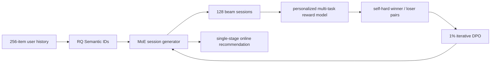

# OneRec: Session-wise generative recommendation with preference alignment

> **Fidelity: 完整核心链路复现**。当前代码实际训练 RQ Semantic IDs、session-wise encoder-decoder、稀疏 MoE、个性化 reward model 和 self-hard DPO；仅缩小模型、session 长度和公开数据规模。

- 论文：[arXiv 2502.18965](https://arxiv.org/abs/2502.18965)，Kuaishou
- Adapter：`onerec`；代码：`src/auto_research/reproductions/onerec/`
- 本地数据：MovieLens-1M；运行：`auto-research reproduce --paper onerec --seed 42`

## 原始论文总结

### 背景与主要改动

传统 retrieve→rank 多阶段系统目标割裂；已有生成式召回又多为 point-wise next-item generation，难以保证一个推荐 session 内的连贯性与多样性。OneRec 用三层 RQ Semantic ID 表示物品，以 MoE 模型一次生成 5 个目标物品的完整 session，并训练个性化 reward model 预测 watch/interaction 指标。Iterative Preference Alignment（IPA）从当前模型 beam-search 的 128 个 session 中选 self-hard winner/loser，仅用 1% 样本做迭代 DPO。



### 核心公式

OneRec 把 $m$ 个目标 item 的 L 层 SID 串成 session，自回归目标为

$$\mathcal L_{NTP}=-\sum_{i=1}^{m}\sum_{j=1}^{L}\log P(s_i^{j+1}\mid s_{BOS},s_1^{1:L},\ldots,s_i^{1:j}).$$

Reward model 对生成 session 预测 SWT、VTR、WTR、LTR。IPA 的 DPO 更新为

$$\mathcal L_{DPO}=-\log\sigma\left(\beta\log\frac{M_{t+1}(S^w\mid H)}{M_t(S^w\mid H)}-
\beta\log\frac{M_{t+1}(S^l\mid H)}{M_t(S^l\mid H)}\right).$$

### 论文离线与线上效果

OneRec-1B 的 max SWT/LTR 为 0.1529/0.0660，高于 TIGER-1B 的 0.1368/0.0579；加入 IPA 后进一步达到 **0.1933/0.1203**。相对 OneRec-1B，IPA 的 max SWT、max LTR 提升 4.04% 和 5.43%；1% DPO 样本达到更高采样率约 95% 的最佳效果。

Kuaishou 主场景使用 1% 流量严格 A/B：

| Model | Total watch time | Average view duration |
|---|---:|---:|
| OneRec-0.1B | +0.57% | +4.26% |
| OneRec-1B | +1.21% | +5.01% |
| OneRec-1B + IPA | **+1.68%** | **+6.56%** |

## 本地复现

> **本地对照口径**：基线是 Session Generator SFT；实验组是 reward model+self-hard DPO 后的 OneRec；NDCG@10 从 0.01565 降至 0（**-100%**）。这是 preference alignment 阶段消融，不是 OneRec 相对 DIN 的结果。

MovieLens-1M 上训练三层 RQ-VAE SID `[256,128,64]`；96d、2-layer encoder-decoder 使用 4 个 top-1 sparse experts，一次生成 3 个 item session。先做 240-step session SFT，再训练 120-step personalized reward model，从生成器 12-beam session 中选 96 组 self-hard winner/loser，执行 80-step DPO。测试时只允许生成 catalog 中存在的 SID prefix。

| Stage | Hit@10 | NDCG@10 | Head share@10 | Valid session |
|---|---:|---:|---:|---:|
| Session generator SFT | **0.0200** | **0.0157** | 0.4372 | 1.0000 |
| + iterative preference alignment | 0.0000 | 0.0000 | **0.1047** | 1.0000 |

SID 唯一率为 **90.80%**；SFT final loss `5.1333`，reward loss 只从 `0.6939` 降到 `0.6804`，DPO loss 却从 `0.1358` 快速降到 `0.00054`。DPO 将 head share 从 43.72% 降到 10.47%，但同时把 SFT 的 NDCG@10 `0.0157` 降到 0。这个组合说明小型 reward model 区分能力不足，策略对它发生了明显的 reward over-optimization；**本地结果否定了当前 DPO 设置，而不是验证 IPA 收益**。旧 heuristic `NDCG +28.78%` 已撤回。

结构化指标见 [`metrics/movielens-1m-seed42.json`](metrics/movielens-1m-seed42.json)。完整运行：

```bash
pip install -e '.[neural-recs]'
AUTO_RESEARCH_ONEREC_CHECKPOINTS=runs/onerec-checkpoints/seed-42 \
auto-research reproduce --paper onerec --dataset-dir data --seed 42
```

数据、RQ-VAE、generator/reward checkpoint 和原始运行结果只保存在被 Git 忽略的 `data/`、`runs/`；MR 只提交代码、文档和脱敏指标。
