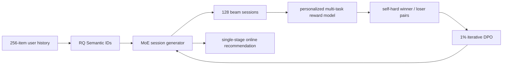

# OneRec: Session-wise generative recommendation with preference alignment

- 论文：[arXiv 2502.18965](https://arxiv.org/abs/2502.18965)，Kuaishou
- Adapter：`onerec`；代码：`src/auto_research/reproductions/onerec/`
- 本地数据：MovieLens-1M；运行：`auto-research reproduce --paper onerec --seed 42`

## 原始论文总结

### 背景与主要改动

传统 retrieve→rank 多阶段系统目标割裂；已有生成式召回又多为 point-wise next-item generation，难以保证一个推荐 session 内的连贯性与多样性。OneRec 用三层 RQ Semantic ID 表示物品，以 MoE 模型一次生成 5 个目标物品的完整 session，并训练个性化 reward model 预测 watch/interaction 指标。Iterative Preference Alignment（IPA）从当前模型 beam-search 的 128 个 session 中选 self-hard winner/loser，仅用 1% 样本做迭代 DPO。

### 核心公式

OneRec 把 $m$ 个目标 item 的 L 层 SID 串成 session，自回归目标为

$$\mathcal L_{NTP}=-\sum_{i=1}^{m}\sum_{j=1}^{L}\log P(s_i^{j+1}\mid s_{BOS},s_1^{1:L},\ldots,s_i^{1:j}).$$

Reward model 对生成 session 预测 SWT、VTR、WTR、LTR。IPA 的 DPO 更新为

$$\mathcal L_{DPO}=-\log\sigma\left(\beta\log\frac{M_{t+1}(S^w\mid H)}{M_t(S^w\mid H)}-
\beta\log\frac{M_{t+1}(S^l\mid H)}{M_t(S^l\mid H)}\right).$$

### 论文离线与线上效果

OneRec-1B 的 max SWT/LTR 为 0.1529/0.0660，高于 TIGER-1B 的 0.1368/0.0579；加入 IPA 后进一步达到 **0.1933/0.1203**。相对 OneRec-1B，IPA 的 max SWT、max LTR 提升 4.04% 和 5.43%；1% DPO 样本达到更高采样率约 95% 的最佳效果。

Kuaishou 主场景使用 1% 流量严格 A/B：

| Model | Total watch time | Average view duration |
|---|---:|---:|
| OneRec-0.1B | +0.57% | +4.26% |
| OneRec-1B | +1.21% | +5.01% |
| OneRec-1B + IPA | **+1.68%** | **+6.56%** |

## 本地复现

在 MovieLens-1M 上用共享检索 backbone 比较 point-wise、最近 5 个行为的 session-wise scoring，以及带语义偏好与流行度惩罚的 reward-margin alignment。两个权重只由 validation 选择，test 为 full catalog。

| Method | Hit@10 | NDCG@10 | Head share@10 |
|---|---:|---:|---:|
| Point-wise retrieval | 0.0358 | 0.0181 | 0.9458 |
| Session-wise generation proxy | 0.0361 | 0.0181 | 0.9657 |
| OneRec + preference alignment proxy | **0.0439** | **0.0232** | **0.6027** |

相对 point-wise 的 NDCG@10 **+28.78%**，同时显著降低头部集中度。这里的 alignment 是可复现 reward-margin proxy，不是生产 reward model、128-beam self-sampling 或完整迭代 DPO。
