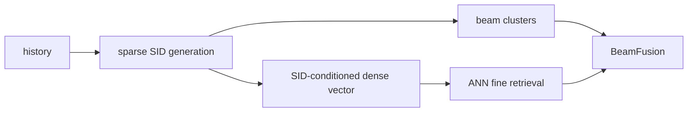

# COBRA：级联稀疏—稠密生成式召回

> **Fidelity: 完整核心链路复现**。稀疏 S-ID、以 S-ID 为条件的稠密向量、联合训练和 coarse-to-fine BeamFusion 均执行；生产 ANN 服务未复刻。

## 论文信息

| 项目 | 内容 |
| --- | --- |
| 论文链接 | [arXiv 2503.02453](https://arxiv.org/abs/2503.02453) |
| 公司/机构 | Baidu |
| 首次公开日期 | 2025-03-04（arXiv v1） |
| 原文开源代码 | 否：论文未提供官方/作者代码（核查日期：2026-07-22） |
| Adapter | `cobra` |
| 本地复现代码 | [`src/auto_research/reproductions/cobra/`](https://github.com/daiwk/auto-research/tree/main/src/auto_research/reproductions/cobra/) |

## 原始论文总结
### 背景与主要改动
纯 Semantic ID 在量化阶段丢失细粒度信息。COBRA 先生成稀疏 code，再以 code 条件生成可端到端更新的 dense vector；推理先 beam 搜索 code，再用 dense 最近邻细排。

### 核心公式
$L=L_{sparse}+\lambda L_{dense}$，其中 $L_{sparse}=-\sum_l\log p(c_l|h,c_{<l})$，$L_{dense}$ 对条件向量与目标 item 做全库 softmax；推理 $s(i)=s_{beam}(c_i)+\alpha q(c_i,h)^Tv_i$。
### 论文离线与线上效果
公开基准优于纯生成与稠密召回；Baidu 线上 conversion **+3.60%**、ARPU **+4.15%**，覆盖 2 亿+日活。

## 本地复现

> **本地对照口径**：统一跨模型基线是 DIN，COBRA NDCG@10 相对 DIN **+25.75%**；内部 sparse-only 基线加入 dense cascade 后 **+45.83%**。两项提升不能相互替代。
180 users/280 items、seeds 42–44。统一 DIN（100 steps）Hit/NDCG 为 0.0481/0.02167；COBRA 为 0.0593/0.02724，NDCG 相对 DIN **+25.75%**。内部 sparse-only→cascade 消融为 **+45.83%**；head share 0.0598→0.2313，收益伴随热门集中。指标见 [`metrics/movielens-100k-seeds42-44.json`](metrics/movielens-100k-seeds42-44.json)。
