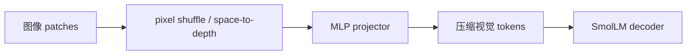
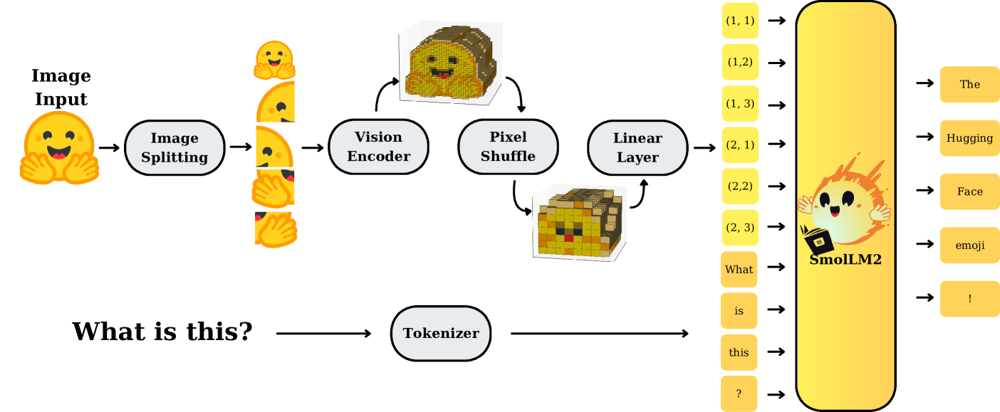

# SmolVLM：面向小模型的视觉 token 压缩

> **保真度：核心机制复现**。本地执行论文中心的 pixel-shuffle 视觉 token 压缩与投影；未复刻 256M–2.2B decoder、视频和完整数据配方。

## 论文信息

| 项目 | 内容 |
| --- | --- |
| 论文链接 | [arXiv 2504.05299](https://arxiv.org/abs/2504.05299) |
| 公司/机构 | Hugging Face |
| 首次公开日期 | 2025-04-07（arXiv v1） |
| 原文开源代码 | 是：[Hugging Face SmolLM/SmolVLM](https://github.com/huggingface/smollm) |
| Adapter | `smolvlm` |
| 本地复现代码 | [`src/auto_research/reproductions/smolvlm/`](https://github.com/daiwk/auto-research/tree/main/src/auto_research/reproductions/smolvlm/) |

## 原始论文总结

### 背景与主要改动

SmolVLM 重新分配小模型视觉/语言侧算力，以 pixel shuffle 将相邻空间 token 搬到 channel
维，再用 MLP 映射到 LM 空间；同时研究长上下文、图像切片、学习位置 token 和数据配比，
使 256M/500M/2.2B 模型在低显存下保持图像与视频能力。



<!-- paper-figure:start -->
### 原论文关键图

[](https://ar5iv.labs.arxiv.org/html/2504.05299/assets/x20.png)

> **原论文 Figure 2（关键图）**：展示原论文提出的核心架构、主要模块及其连接关系。图片来自[原论文](https://arxiv.org/abs/2504.05299)，版权归原作者所有；点击图片可查看来源。
<!-- paper-figure:end -->

### 核心公式

$$
X'_{h,w,:}=\operatorname{Concat}_{0\le i,j<r}X_{rh+i,rw+j,:},
\qquad |X'|=|X|/r^2.
$$

### 论文离线与线上效果

最小 256M 模型推理显存低于 1GB，并超过参数约大 300 倍的 Idefics-80B；2.2B 版本达到
更大 VLM 的竞争水平。论文报告 image/video benchmarks，没有工业线上 A/B。

## 本地复现

> **本地对照口径**：基线为线性 mean-pooling connector，实验组为 `r=2` pixel shuffle + projector；test accuracy `46.8% → 65.8%`（**+19.0 points**），视觉 token `16 → 4`（**-75%**）。

```bash
auto-research reproduce --paper smolvlm --dataset-dir data --seed 42
```

固定指标见 [`metrics/fashion-mnist-qa-seed42.json`](metrics/fashion-mnist-qa-seed42.json)。

## 复现边界

使用 32×32 真实服饰图像和 2×2 space-to-depth；没有复刻高分辨率切片、视频采样、
8k/16k context、学习位置 token 或 SmolLM decoder。
