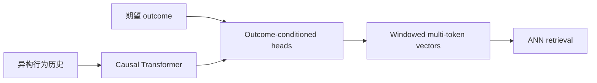

# PinRec：Outcome-Conditioned 多 token 生成式召回

> **Fidelity: 完整核心链路复现**。真实执行因果 decoder、outcome embedding、归一化 ANN 输出、无序未来窗口 multi-token 对比学习；MovieLens 评分档位替代 Pinterest 多 surface action。

## 论文信息

| 项目 | 内容 |
| --- | --- |
| 论文链接 | [arXiv 2504.10507](https://arxiv.org/abs/2504.10507) |
| 公司/机构 | Pinterest |
| 首次公开日期 | 2025-04-09（arXiv v1） |
| 原文开源代码 | 否：论文未提供官方/作者代码（核查日期：2026-07-22） |
| Adapter | `pinrec` |
| 本地复现代码 | [`src/auto_research/reproductions/pinrec/`](https://github.com/daiwk/auto-research/tree/main/src/auto_research/reproductions/pinrec/) |

## 原始论文总结

### 背景与主要改动

普通 next-item 只会延续用户最常见行为，且严格顺序不适合 feed session。PinRec 把期望 outcome 注入输出头，并在同一未来窗口一次生成多个 ANN-compatible item vectors。



### 核心公式

$$
\hat i_{u,t}^{(k)}=\mathrm{norm}(O_k([h_t;e(a_{desired})])),\qquad
\mathcal L_{MT}=-\sum_k\log\frac{\exp(\hat i^{(k)}\cdot i^+_{\pi(k)}/\tau)}{\sum_j\exp(\hat i^{(k)}\cdot i_j/\tau)}.
$$

### 论文离线与线上效果

原论文 Homefeed unordered Recall@10：UC 0.608、OC 0.625、MT+OC **0.676**；16 outputs 相对 OC 延迟约降 10 倍、recall +16%、diversity +21.3%。线上 MT+OC：Fulfilled Sessions +0.28%、Time Spent +0.55%、Homefeed Grid Clicks +3.33%；纯 OC Grid Clicks最高 **+4.01%**。

## 本地复现

> **本地对照口径**：基线是 unconditioned next-token 模型；实验组是 outcome-conditioned 三 token window；Unordered Recall@10 **-27.78%**、NDCG@10 **-34.82%**。这是 outcome/multi-token 模块消融，不是相对 DIN。

| Model | Unordered Recall@10 | NDCG@10 |
|---|---:|---:|
| UC next-token | **0.00318 ± 0.00184** | **0.00132 ± 0.00085** |
| OC + 3-token window | 0.00230 ± 0.00061 | 0.00086 ± 0.00034 |

经过一次协议修正和 160→200 steps 迭代，OC+MT 仍分别下降 27.78% / 34.82%。MovieLens 只有稀疏评分 outcome 和两个 held-out future events，无法提供 Pinterest 的多行为窗口监督；不把负结果调参隐藏。指标见 [`metrics/movielens-100k-seeds42-44.json`](metrics/movielens-100k-seeds42-44.json)。

```bash
for seed in 42 43 44; do AUTO_RESEARCH_PINREC_STEPS=200 auto-research reproduce --paper pinrec --dataset-dir data --seed "$seed"; done
```
