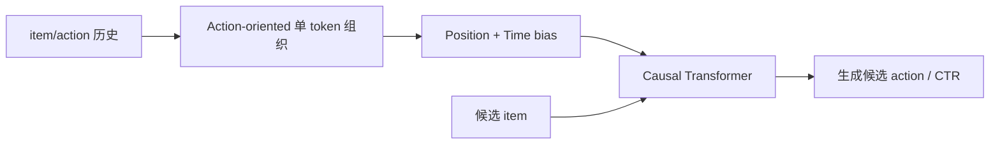

# GenRank：面向工业排序的生成式 action 建模

> **Fidelity: 完整核心链路复现**。真实执行 item/action 交错基线、action-oriented 组织、位置/时间偏置、因果 Transformer 和 action 生成；缩小为 MovieLens 显式反馈。

- 论文：[arXiv 2505.04180](https://arxiv.org/abs/2505.04180)，Xiaohongshu
- Adapter：`genrank`；运行：`auto-research reproduce --paper genrank --seed 42`

## 原论文

HSTU 式排序把 item 与 action 交错为两倍长序列。GenRank 将 action 作为同一 item token 的监督/特征，并加入 position 与 time bias，在不丢掉多行为生成目标的前提下降低排序成本。



$$h_t=e(i_t)+e(a_t)+e(p_t)+e(\Delta t_t),\qquad
\mathcal L=-y\log\sigma(s)-(1-y)\log(1-\sigma(s)).$$

论文消融中 action-oriented 组织加速 78.7%，position/time bias 再加速 25.0%，合计 **94.8%**，AUC +0.0006。小红书 Explore Feed 使用各 10% 用户、15 天 A/B：Time Spent +0.3345%、Reads +0.6325%、Engagements **+1.2474%**、LT7 +0.1481%。

## 本地结果

| Model | AUC mean ± std | ms/example mean ± std |
|---|---:|---:|
| Interleaved item/action | **0.74282 ± 0.00997** | 0.15052 ± 0.08484 |
| GenRank action-oriented | 0.73939 ± 0.00228 | **0.11190 ± 0.00767** |

序列压缩带来 **25.66%** 延迟下降，但 AUC -0.46%；本地复现效率机制，没有复现论文的精度持平。指标见 [`metrics/movielens-100k-seeds42-44.json`](metrics/movielens-100k-seeds42-44.json)。数据、runs 与 checkpoint 不提交。

```bash
for seed in 42 43 44; do AUTO_RESEARCH_GENRANK_STEPS=120 AUTO_RESEARCH_GENRANK_TRAIN=8000 AUTO_RESEARCH_GENRANK_TEST=2000 auto-research reproduce --paper genrank --dataset-dir data --seed "$seed"; done
```
