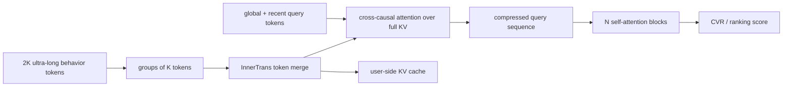

# LONGER: Ultra-long sequence modeling at ByteDance

- 论文：[arXiv 2505.04421](https://arxiv.org/abs/2505.04421)，ByteDance / Douyin
- Adapter：`longer`；代码：`src/auto_research/reproductions/longer/`
- 本地数据：MovieLens-100K；运行：`auto-research reproduce --paper longer --seed 42`

## 原始论文总结

### 背景与主要改动

工业长序列常用两阶段检索或截断，既有上下游不一致，也有 $O(L^2)$ attention 和 GPU serving 成本。LONGER 加入 global token 稳定全局兴趣；每 K 个相邻行为通过轻量 InnerTrans 合并成一个 token；第一层让少量 recent queries 对完整 KV 做 cross-causal attention，后续只在压缩后的 query 上做 self-attention。训练侧使用混合精度/activation recomputation，serving 侧使用 user KV cache。

### 核心公式

局部合并为 $M_i=TransformerBlock([e_i^1,\ldots,e_i^K])$。global/recent query 为 $O=[G;H_S]$，第一层执行

$$Q=OW_Q,\quad K=RW_K,\quad V=RW_V,$$
$$Attention(Q,K,V)=Softmax(QK^T/\sqrt d+M)V.$$

合并后的 attention FLOPs 比例为

$$\frac{FLOPs_{merge}}{FLOPs_{vanilla}}=\frac{6dK+L/K}{6d+L}.$$

### 论文离线与线上效果

Douyin Ads 5.2B 样本 CVR 数据上，LONGER AUC 0.85290、LogLoss 0.47103，相对 base 为 +1.57%/-3.39%；recent 100 queries 仅用约 54% FLOPs，接近 250-query 效果。KV cache 将 serving throughput degradation 从约 -40% 降到 -6.8%。

| Online scenario | Metric 1 | Metric 2 |
|---|---:|---:|
| Douyin Ads Live | ADSS +1.063% | ADVV +1.168% |
| Douyin Ads Short Video | ADSS +2.097% | ADVV +2.151% |
| Douyin E-commerce Live | Order/U +7.9222% | GMV/U +6.5404% |
| Douyin E-commerce Short Video | Order/U +4.6125% | GMV/U +5.2771% |

## 本地复现

MovieLens-100K 上实现 global summary、group size=4 的局部变化保留式 token merge，以及 recent-query hybrid attention；三个 seed，merge weight 仅由 validation 选择。

| Architecture | Hit@10 | NDCG@10 |
|---|---:|---:|
| Recent-sequence transformer proxy | 0.0697 ± 0.0038 | 0.0340 ± 0.0017 |
| LONGER token-merge proxy | 0.0694 ± 0.0013 | **0.0341 ± 0.0012** |

NDCG@10 **+0.41%**，提升小于 seed 波动，只能证明压缩没有明显破坏质量。ByteDance 私有长序列、5.2B 样本和 GPU 同步 serving 不可公开，因此这不是 headline 复刻。
