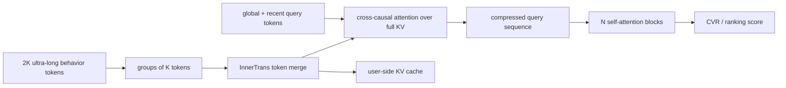
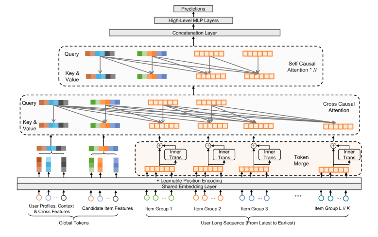

# LONGER: Ultra-long sequence modeling at ByteDance

> **Fidelity: 核心机制复现**。当前代码端到端训练 InnerTrans 分组压缩、global interest token 与 hybrid attention；未复刻 ByteDance 私有特征、分布式训练和生产 serving。

## 论文信息

| 项目 | 内容 |
| --- | --- |
| 论文链接 | [arXiv 2505.04421](https://arxiv.org/abs/2505.04421) |
| 公司/机构 | ByteDance / Douyin |
| 首次公开日期 | 2025-05-07（arXiv v1） |
| 原文开源代码 | 否：论文未提供官方/作者代码（核查日期：2026-08-09） |
| Adapter | `longer` |
| 本地复现代码 | [`src/auto_research/reproductions/longer/`](https://github.com/daiwk/auto-research/tree/main/src/auto_research/reproductions/longer/) |

## 原始论文总结

### 背景与主要改动

工业长序列常用两阶段检索或截断，既有上下游不一致，也有 $O(L^2)$ attention 和 GPU serving 成本。LONGER 加入 global token 稳定全局兴趣；每 K 个相邻行为通过轻量 InnerTrans 合并成一个 token；第一层让少量 recent queries 对完整 KV 做 cross-causal attention，后续只在压缩后的 query 上做 self-attention。训练侧使用混合精度/activation recomputation，serving 侧使用 user KV cache。

```mermaid
flowchart LR
  A["2K ultra-long behavior tokens"] --> B["groups of K tokens"]
  B --> C["InnerTrans token merge"]
  D["global + recent query tokens"] --> E["cross-causal attention over full KV"]
  C --> E
  E --> F["compressed query sequence"]
  F --> G["N self-attention blocks"]
  G --> H["CVR / ranking score"]
  C --> I["user-side KV cache"]
```

<!-- paper-figure:start -->
### 原论文关键图

> **原论文 Figure 1（关键图）**：展示原论文提出的核心架构、主要模块及其连接关系。图片来自[原论文](https://arxiv.org/abs/2505.04421)，版权归原作者所有；点击图片可查看来源。
<!-- paper-figure:end -->

### 核心公式

局部合并为 $M_i=TransformerBlock([e_i^1,\ldots,e_i^K])$。global/recent query 为 $O=[G;H_S]$，第一层执行

$$
Q=OW_Q,\quad K=RW_K,\quad V=RW_V,
$$
$$
Attention(Q,K,V)=Softmax(QK^T/\sqrt d+M)V.
$$

合并后的 attention FLOPs 比例为

$$
\frac{FLOPs_{merge}}{FLOPs_{vanilla}}=\frac{6dK+L/K}{6d+L}.
$$

### 论文离线与线上效果

Douyin Ads 5.2B 样本 CVR 数据上，LONGER AUC 0.85290、LogLoss 0.47103，相对 base 为 +1.57%/-3.39%；recent 100 queries 仅用约 54% FLOPs，接近 250-query 效果。KV cache 将 serving throughput degradation 从约 -40% 降到 -6.8%。

| Online scenario | Metric 1 | Metric 2 |
|---|---:|---:|
| Douyin Ads Live | ADSS +1.063% | ADVV +1.168% |
| Douyin Ads Short Video | ADSS +2.097% | ADVV +2.151% |
| Douyin E-commerce Live | Order/U +7.9222% | GMV/U +6.5404% |
| Douyin E-commerce Short Video | Order/U +4.6125% | GMV/U +5.2771% |

## 本地复现

> **本地对照口径**：基线与实验组使用相同 embedding、维度、优化器、训练步数和全库评测；实验组加入 InnerTrans、global token 与 hybrid attention，NDCG@10 **-21.37%**。它不是相对 DIN。

MovieLens-100K 全量公开交互上，group size=4；每组行为先进入可训练 InnerTrans 和 attention pooling，再与 global/recent tokens 一起进入 hybrid Transformer。三个 seed 独立从头训练，test 不参与选型。

| Architecture | Hit@10 | NDCG@10 |
|---|---:|---:|
| Recent-sequence Transformer | **0.0057 ± 0.0013** | **0.0026 ± 0.0008** |
| LONGER hybrid attention | 0.0046 ± 0.0040 | 0.0020 ± 0.0017 |

NDCG@10 **-21.37%**，且方差很大；在 90-step 小预算下，新增长历史结构没有收敛到优于 recent baseline。该结果不支持把论文线上收益外推到 MovieLens。ByteDance 私有长序列、5.2B 样本和 GPU serving 不可公开。稳定指标见 [`metrics/movielens-100k-seeds42-44.json`](metrics/movielens-100k-seeds42-44.json)。
