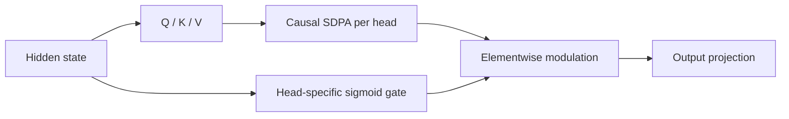

# Gated Attention：在 SDPA 输出后加入逐头门控

> **Fidelity: 核心机制复现**。真实训练论文最优的 head-specific sigmoid gate，并记录门控分布。

## 论文信息

| 项目 | 内容 |
| --- | --- |
| 论文链接 | [arXiv 2505.06708](https://arxiv.org/abs/2505.06708) |
| 公司/机构 | Qwen / Alibaba |
| 首次公开日期 | 2025-05-10（arXiv v1） |
| 原文开源代码 | 是：[官方/作者代码](https://github.com/qiuzh20/gated_attention) |
| Adapter | `gated-attention` |
| 本地复现代码 | [`src/auto_research/reproductions/gated_attention/`](https://github.com/daiwk/auto-research/tree/main/src/auto_research/reproductions/gated_attention/) |

## 原始论文总结

### 背景与主要改动

softmax attention 的 value aggregation 到 output projection 之间基本是线性映射。论文系统比较 30 种门控变体，发现最简单稳定的方案是在每个 attention head 的 SDPA 输出后施加 query-dependent sigmoid gate：既增加非线性，也能稀疏抑制无用 head 输出。



### 核心公式

$$
a_{t,h}=\operatorname{SDPA}(q_{t,h},K_h,V_h),\qquad
\tilde a_{t,h}=\sigma(w_h^\top h_t+b_h)\,a_{t,h}.
$$

门放在 SDPA 之后而不是 score、value 或 output projection 之后，这是论文大规模消融选出的关键位置。

### 论文离线与线上效果

论文在 3.5T tokens 上训练 1.7B dense 与 15B MoE，共比较 30 个变体；post-SDPA head-specific gate 持续改善性能、训练稳定性、较大学习率容忍度与 scaling，并缓解 attention sink、改善长上下文外推。纯 LLM 论文不适用线上 A/B 门槛。

## 本地复现

> **本地对照口径**：基线是同预算 `llama_modern`；实验组只增加 post-SDPA 逐头 sigmoid gate，WikiText-2 LM loss `5.7471→5.7398`，相对 **-0.13%**，PPL 相对 **-0.72%**。

训练后平均 gate 为 `0.5358`，`22.80%` 的 gate 低于 0.5，说明门控不是恒等旁路。稳定结果见 [`metrics/wikitext2-seed42.json`](metrics/wikitext2-seed42.json)。

```bash
auto-research reproduce --paper gated-attention --dataset-dir data --seed 42
```

## 复现边界

未执行 3.5T-token、1.7B/15B scaling、完整学习率 sweep 与长上下文矩阵；本地只验证论文最优门控位置的实际训练路径。
