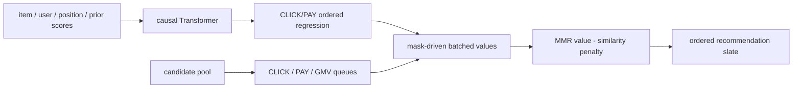

# SORT-Gen：列表级多目标生成式重排

> **Fidelity: 核心机制复现**。实际训练 causal Transformer ordered regression，并执行多目标队列、mask-driven 单次批量评分和 MMR；私有曝光与线上 kernel 缩小。

## 论文信息

| 项目 | 内容 |
| --- | --- |
| 论文链接 | [arXiv 2505.07197](https://arxiv.org/abs/2505.07197) |
| 公司/机构 | Alibaba / Taobao & Tmall |
| 首次公开日期 | 2025-05-12（arXiv v1） |
| 原文开源代码 | 否：论文未提供官方/作者代码（核查日期：2026-07-22） |
| Adapter | `sort-gen` |
| 本地复现代码 | [`src/auto_research/reproductions/sort_gen/`](https://github.com/daiwk/auto-research/tree/main/src/auto_research/reproductions/sort_gen/) |

## 原始论文总结

### 背景与主要改动

传统公式或 LTR 在 item level 优化 CTR、CVR、GMV，无法建模已选前缀对后续 item 的影响。SORT-Gen 用 causal Transformer 输入 item、user、position 和上游 CTR/CVR score，在每个前缀位置预测“累计行为数是否至少达到第 $i$ 档”的 ordered-regression 概率，从而估计加入 item 后的列表边际价值。

推理先建立 CLICK、PAY、GMV 等目标队列，把搜索空间从全部候选降到队首。Mask-Driven Fast Generation 用张量 mask 记录已选 item 与队列状态，在一次批量模型调用中计算多个位置/队列的价值；MMR 直接进入选择目标，避免生成后再做多样性后处理。



### 核心公式

$$
E_{\mathrm{input}}=E_{\mathrm{item}}\oplus E_{\mathrm{position}}\oplus E_{\mathrm{user}}\oplus E_{\mathrm{score}}.
$$

$$
\mathcal L(\theta)=\sum_{i=1}^{l}\sum_{j=1}^{l}\mathcal L_{i,j}^{\mathrm{CLICK}}+
\sum_{i=1}^{l}\sum_{j=1}^{l}\mathcal L_{i,j}^{\mathrm{PAY}},
$$

其中第 $(i,j)$ 个二分类目标判断长度为 $j$ 的前缀累计行为数是否达到 $i$。多样性选择为：

$$
\arg\max_{i_a\in Q\setminus S}\left[
\lambda V([S,i_a],S)-(1-\lambda)\max_{i_b\in S}\operatorname{SIM}(i_a,i_b)
\right].
$$

### 论文离线与线上效果

相对 item-level greedy formula，SORT-Gen 的 CLICK `+9.61%`、ORDER `+8.35%`、GMV `+13.67%`。相对当时全量部署的 FFT Context-aware Model + fastDPP，CLICK `+4.13%`、GMV `+8.10%`。淘宝“百亿补贴”A/B 持续两周，端到端延迟 `19 ms`，之后部署到淘宝多个场景。

## 本地复现

> **本地对照口径**：基线严格使用 item-level greedy formula，以公开 prior click/pay/GMV proxy 按 `5:1:1` 排序；实验组使用同一候选和 prior，再加入训练后的 ordered regression、三路队列、mask 去重和 MMR，Click 相对 `+5.10%`。

MovieLens-1M 构造 4,742 个训练 exposure slates、210 validation 和 210 test slates；每组从 20 candidates 选 8。训练 loss `1.0724→0.4022`，validation 选择 $\lambda=1.0$。相对公式基线，本地 Click/slate `+5.10%`、Pay/slate `+8.46%`、GMV proxy `+9.00%`、ILAD `+2.89%`；生成器每个 slate 只进行一次 batched model call。稳定指标见 [`metrics/movielens-1m-seed42.json`](metrics/movielens-1m-seed42.json)。

```bash
auto-research reproduce --paper sort-gen --seed 42
```

## 复现边界

MovieLens rating/genre/popularity 分别代理点击、交易、商品内容和上游 score；没有淘宝真实曝光、CVR/GMV、用户商业特征和多模态 embedding。单次调用是 PyTorch 批量路径，不等价于论文生产 19 ms kernel；本地 proxy 指标不能和线上百分比直接比较。
