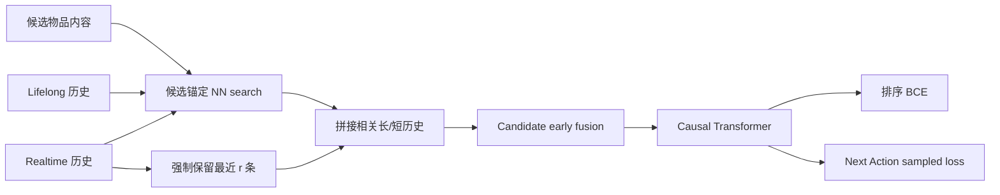

# TransAct V2：Lifelong User Action Sequence Modeling

> 保真度：**核心机制复现**。候选锚定的长/短序列近邻检索、最近行为保留、early-fusion causal Transformer 和 Next Action Loss 均实际训练；MovieLens genre 替代 PinSage embedding，省略 Pinterest action/surface 字段、曝光日志负例及生产 Triton kernel。

## 论文信息

| 项目 | 内容 |
| --- | --- |
| 论文链接 | [arXiv 2506.02267](https://arxiv.org/abs/2506.02267) |
| 公司/机构 | Pinterest |
| 首次公开日期 | 2025-06-02（arXiv v1） |
| 原文开源代码 | 否：论文未提供官方/作者代码（核查日期：2026-07-15） |
| Adapter | `transact-v2` |
| 本地复现代码 | [`src/auto_research/reproductions/transact_v2/`](https://github.com/daiwk/auto-research/tree/main/src/auto_research/reproductions/transact_v2/) |

## 原始论文总结

### 背景与主要改动

TransAct 主要建模约百条实时行为，容易忽略用户多年的长期兴趣。TransAct V2 从约 $10^4$ 条 lifelong 序列中按候选相似度取回相关行为，同时保留最近行为，再通过共享 Transformer 做 CTR 排序；额外的 Next Action Loss 迫使序列表征预测下一次正向互动。论文也包含 SKUT、request deduplication 等 serving 优化，本地复现聚焦模型链路。



### 核心公式

候选 $c$ 对序列 $S$ 的检索为：

$$
NN(S,c)=\{S_i\mid i\in\operatorname{TopK}(E(S)e_c)\},
$$

$$
S_{all}=NN(S_{LL},c)\oplus S_{RT}[:r]\oplus NN(S_{RT}[r:],c).
$$

Next Action Loss 对时刻 $t$ 的用户表示、下一正样本 $p_{t+1}$ 和负样本集合 $N_u$ 使用 sampled softmax：

$$
L_{NAL}=-\sum_{u,t}\log\frac{e^{\langle u_t,p_{t+1}\rangle}}
{e^{\langle u_t,p_{t+1}\rangle}+\sum_{n\in N_u}e^{\langle u_t,n\rangle}},
\qquad L=L_{CTR}+w_{NAL}L_{NAL}.
$$

### 论文离线与线上效果

- 离线：相对无序列 baseline，BST/TransAct/TransAct V2 的 Repin HIT@3 分别 +6.04%/+7.74%/+13.31%；TransAct V2 Hide HIT@3 -11.25%。
- 在线：每组 1.5% Pinterest Homefeed 流量；相对 TransAct，Repin Volume +6.35%、Hide Volume -12.80%、Impression Diversity +0.45%、App Time Spent +1.41%。
- Serving：论文生产形状下 SKUT 相对 PyTorch latency -85.09%，end-to-end p99 提升约 250 倍；这些 kernel 数字未在 Mac 上冒充复现。

## 本地复现

> **本地对照口径**：基线是参数量匹配的 TransAct；实验组是 TransAct V2；NDCG@10 从 0.01277 升至 0.02460（**+92.65%**），head share 同时 +14.70pt。这里比较 V2 相对 V1，不是相对 DIN。

MovieLens-100K 自动下载到本地；932 个有效用户、1,682 个物品，时间顺序 leave-two-out、完整物品库排序。以 genre 向量代替 PinSage 内容 embedding；TransAct 与 V2 参数量同为 137,073，种子 42/43/44，每个 160 step，Apple MPS。

| Model | Hit@10 | NDCG@10 | Head share@10 |
|---|---:|---:|---:|
| TransAct | 0.02718 ± 0.00134 | 0.01277 ± 0.00114 | 0.84295 |
| TransAct V2 | 0.04936 ± 0.00175 | 0.02460 ± 0.00057 | 0.98995 |

TransAct V2 的 NDCG@10 为 **+92.65%**，但推荐头部占比同时增加 14.70 个百分点并接近 99%。公开数据验证了“候选相关长历史 + sampled-softmax NAL”的相关性收益，同时提示小数据上会放大 popularity bias；两者必须一起汇报。

审计指标见 [metrics/movielens-100k-seeds42-44.json](metrics/movielens-100k-seeds42-44.json)。

## 复现命令

```bash
auto-research reproduce --paper transact-v2 --seed 42
```
