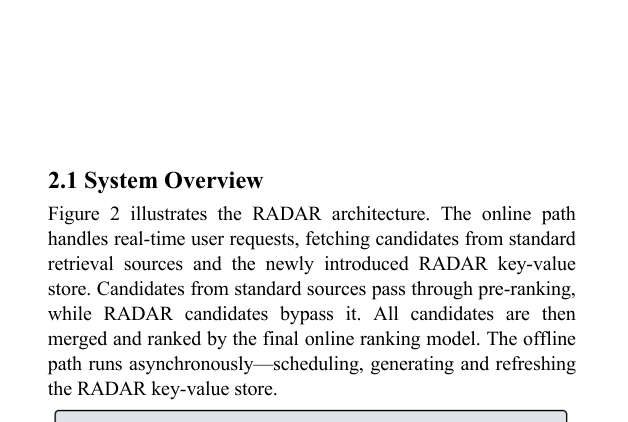

# RADAR: Recall Augmentation through Deferred Asynchronous Retrieval

> **保真度：核心机制复现**。原文结论、本地公开数据实验和未复刻部分分开陈述。

## 论文信息

| 字段 | 内容 |
|---|---|
| 论文链接 | [arXiv 2506.07261](https://arxiv.org/abs/2506.07261) |
| 公司/机构 | Meta |
| 首次公开日期 | 2025-06-08（arXiv v1） |
| 原文开源代码 | 否：未发现/未发布原作者官方代码仓库（核查日期：2026-08-08） |
| Adapter | `radar` |
| 本地复现代码 | [`src/auto_research/reproductions/radar/`](https://github.com/daiwk/auto-research/tree/main/src/auto_research/reproductions/radar/) |

## 原始论文总结

### 背景与主要改动

将完整排序模型在本次请求后异步运行，把高价值结果缓存为下一次请求的召回补充，再与实时召回合并。


<!-- paper-figure:start -->
### 原论文关键图

[](https://arxiv.org/pdf/2506.07261#page=2)

> **原论文 Figure 2（关键图）**：展示原论文提出的核心架构、主要模块及其连接关系。图片来自[原论文](https://arxiv.org/abs/2506.07261)，版权归原作者所有；点击图片可查看来源。
<!-- paper-figure:end -->

### 核心公式

$$
C_{t+1}=R_{live}(h_{t+1})\cup\operatorname{TopK}(f_{rank}(h_t,\mathcal I)).
$$

### 论文离线与线上效果

线上 Recall@200 约翻倍，engagement +0.8%。

## 本地复现

> **本地对照口径**：基线为共享 transition + content scorer，实验组只加入 `radar` 核心机制；相对 NDCG@10 -2.78%。

MovieLens-100K、260 users / 420 items、seed 42：NDCG@10 0.0354 → **0.0344（-2.78%）**。基线是共享 transition + content scorer；实验组只加入论文核心路径。

```bash
auto-research reproduce --paper radar --dataset-dir data --seed 42
auto-research evolve --model rankmixer --dataset movielens-100k --direction "组合 radar 与已安装论文算子" --generations 2 --population 4
```

固定指标见 [`metrics/public-seed42.json`](metrics/public-seed42.json)。

## 复现边界

在 MovieLens-100K 全库排序上实际执行论文核心状态、训练目标或推理路径；未使用公司私有特征、生产流量和在线服务，线上 A/B 数字只引用原文。 本地数值不等同于原论文大模型、私有数据、生产流量或专用 kernel；本地相对变化不得与原文提升混写。
