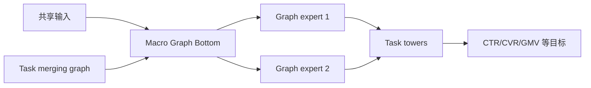
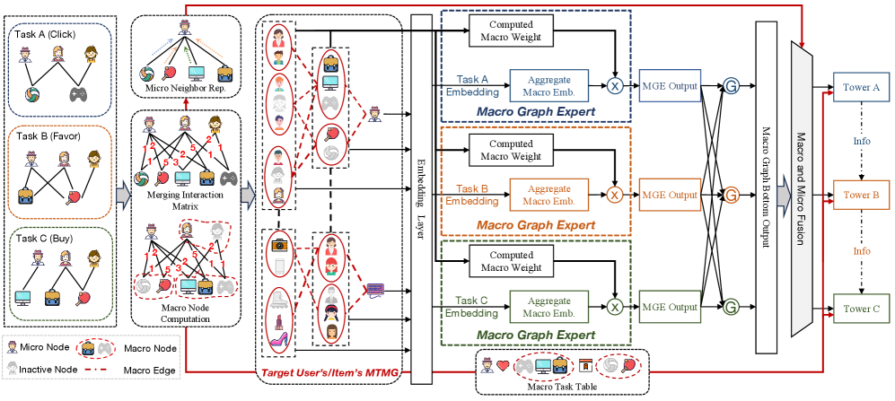

# MGOE：宏观任务图专家网络

> **Fidelity: 核心机制复现**。实际估计多任务相关图，执行宏观图传播 experts 和任务门控预测。

## 论文信息

| 项目 | 内容 |
| --- | --- |
| 论文链接 | [KDD 2026](https://arxiv.org/abs/2506.10520) |
| 公司/机构 | Alibaba |
| 首次公开日期 | 2025-06-12（arXiv v1） |
| 原文开源代码 | 是：[官方/作者代码](https://github.com/RainmannnnN/MGOE) |
| Adapter | `mgoe` |
| 本地复现代码 | [`src/auto_research/reproductions/mgoe/`](https://github.com/daiwk/auto-research/tree/main/src/auto_research/reproductions/mgoe/) |

## 原始论文总结

### 背景与主要改动

MMoE 只在样本级通过 gate 隐式共享，难表达任务间稳定结构。MGOE 先构建 Macro Task Merging Graph，再由 Macro Graph Bottom/Experts 传播跨任务信息，最后进入任务塔。



<!-- paper-figure:start -->
### 原论文关键图

[](https://arxiv.org/html/2506.10520v5/x2.png)

> **原论文 Figure 2（关键图）**：展示原论文方法的总体设计和关键组成。图片来自[原论文](https://arxiv.org/abs/2506.10520)，版权归原作者所有；点击图片可查看来源。
<!-- paper-figure:end -->

### 核心公式

$$
H^{l+1}=\sigma(\tilde A H^lW_l),\qquad
\hat y_t=\operatorname{Tower}_t\!\left(\sum_e g_{t,e}H_e\right).
$$

### 论文离线与线上效果

论文在公开多任务数据与阿里私有数据上优于 Shared-Bottom、MMoE、PLE、MacGNN。线上相对 MMoE：PCTR `+2.16%`、UCTR `+1.63%`、CVR `+5.88%`、GMV `+16.46%`、stay time `+4.12%`。

## 本地复现

> **本地对照口径**：相对 MMoE 独立 gate 基线，实验组 NDCG@10 `+7.03%`。

用 MovieLens 行为/genre 构造三个任务。相对独立 gate 基线：NDCG@10 `0.07514→0.08042`（`+7.03%`），Hit@10 `0.14048→0.15952`；head share 同时上升。指标见 [`metrics/movielens-1m-seed42.json`](metrics/movielens-1m-seed42.json)。

```bash
auto-research reproduce --paper mgoe --dataset-dir data --seed 42
```

## 复现边界

公开 proxy 任务远小于工业多目标；没有十亿级 sparse embedding、分布式图构建和阿里线上特征。
