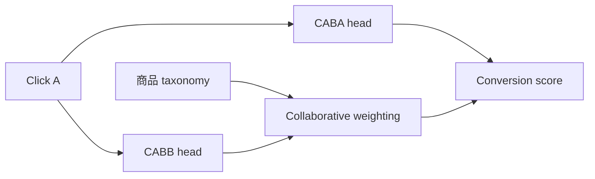
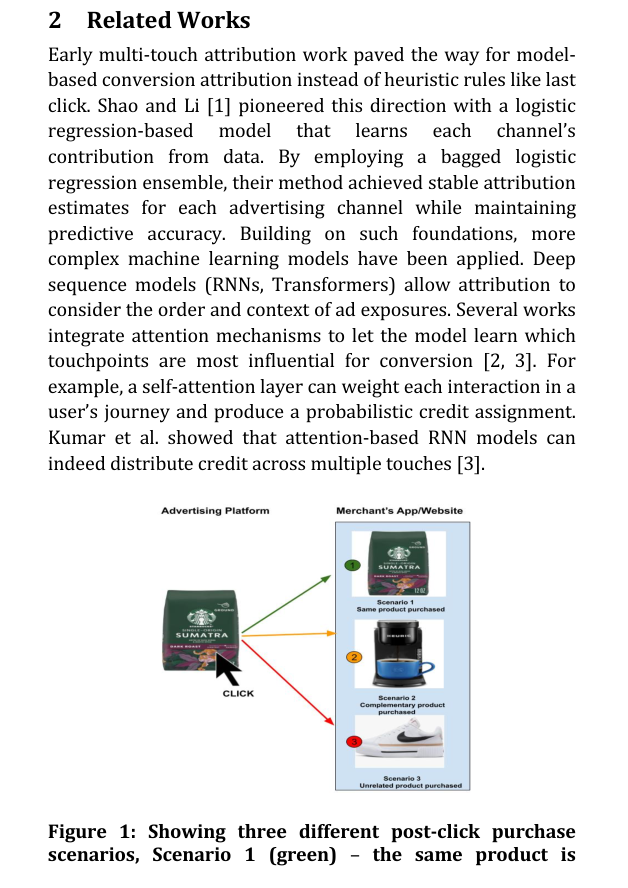

# Click A, Buy B：跨物品转化归因

> **Fidelity: 核心机制复现**。实际构造 CABA/CABB 双分支，并按公开 genre taxonomy 学习跨物品协同权重。

## 论文信息

| 项目 | 内容 |
| --- | --- |
| 论文链接 | [arXiv 2507.15113](https://arxiv.org/abs/2507.15113) |
| 公司/机构 | Pinterest |
| 首次公开日期 | 2025-07-20（arXiv v1） |
| 原文开源代码 | 否：论文未提供官方/作者代码（核查日期：2026-08-09） |
| Adapter | `click-a-buy-b` |
| 本地复现代码 | [`src/auto_research/reproductions/click_a_buy_b/`](https://github.com/daiwk/auto-research/tree/main/src/auto_research/reproductions/click_a_buy_b/) |

## 原始论文总结

### 背景与主要改动

Last-click attribution 默认点击和购买属于同一商品，忽略用户点 A 后买 B。论文将 Click-A-Buy-A 与 Click-A-Buy-B 分成多任务，并用商品 taxonomy 建模 A/B 的协同归因。



<!-- paper-figure:start -->
### 原论文关键图

[](https://arxiv.org/pdf/2507.15113#page=2)

> **原论文 Figure 1（关键图）**：展示原论文方法的总体设计和关键组成。图片来自[原论文](https://arxiv.org/abs/2507.15113)，版权归原作者所有；点击图片可查看来源。
<!-- paper-figure:end -->

### 核心公式

$$
\hat p(B|A,u)=w_{AB}^{tax}\,\hat p_{\mathrm{CABB}}(B|A,u),\qquad
\mathcal L=\mathcal L_{\mathrm{CABA}}+\lambda\mathcal L_{\mathrm{CABB}}.
$$

### 论文离线与线上效果

论文离线显示 CABA/CABB 联合建模改善跨商品转化归因；Pinterest 线上主要业务指标 `+0.25%`。

## 本地复现

> **本地对照口径**：相对 last-click 单物品归因基线，实验组 NDCG@10 `+33.70%`。

用连续观影代理 Click-A/Buy-B。相对 last-click 单物品归因：NDCG@10 `0.07514→0.10045`（`+33.70%`），Hit@10 `0.14048→0.15714`，head share `0.21762→0.14119`。指标见 [`metrics/movielens-1m-seed42.json`](metrics/movielens-1m-seed42.json)。

```bash
auto-research reproduce --paper click-a-buy-b --dataset-dir data --seed 42
```

## 复现边界

连续观影不等价于购买；没有真实曝光、归因窗口、广告竞价和 Pinterest taxonomy。
