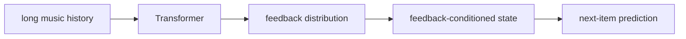

# ARGUS：十亿参数推荐 Transformer 的反馈—物品分解

> **Fidelity: 核心机制复现**。matched Transformer 中实际执行 feedback-first、next-item-second 分解；未复刻十亿参数规模与私有音乐反馈。

## 原始论文总结
### 背景与主要改动
直接 next-item 预测把“用户会怎样反馈”和“会消费哪个 item”纠缠。ARGUS 先预测 feedback token，再以其条件化 next-item，使多种反馈共享序列主干并获得更好的 scaling。

### 核心公式
$p(i_{t+1},f_{t+1}|h_t)=p(f_{t+1}|h_t)p(i_{t+1}|h_t,f_{t+1})$，训练 $L=L_{item}+\lambda L_{feedback}$。
### 论文离线与线上效果
模型扩展至 1B 参数，feedback/next-item NE 分别下降约 18%/22%；Yandex Music 总收听时长 **+2.26%**、like likelihood **+6.37%**。

## 本地复现
第一轮 $\lambda=0.35$ NDCG -17.92%；第二轮选择 0.1、100 steps。NDCG 0.01720→0.01739（**+1.09%**），但 Hit@10 0.0407→0.0278 且 head share 上升，结论混合。指标见 [`metrics/movielens-100k-seeds42-44.json`](metrics/movielens-100k-seeds42-44.json)。

