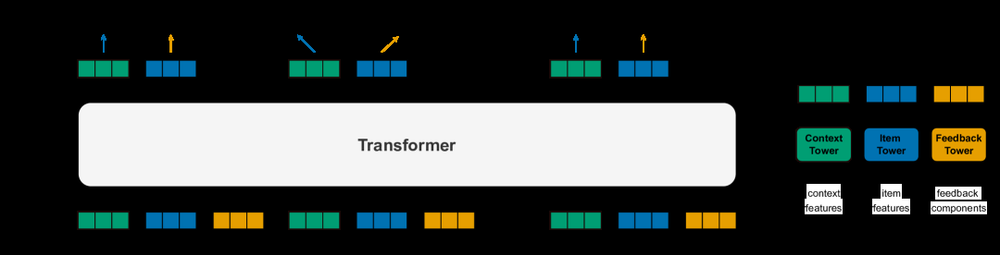

# ARGUS：十亿参数推荐 Transformer 的反馈—物品分解

> **Fidelity: 核心机制复现**。matched Transformer 中实际执行 feedback-first、next-item-second 分解；未复刻十亿参数规模与私有音乐反馈。

## 论文信息

| 项目 | 内容 |
| --- | --- |
| 论文链接 | [arXiv 2507.15994](https://arxiv.org/abs/2507.15994) |
| 公司/机构 | Yandex |
| 首次公开日期 | 2025-07-21（arXiv v1） |
| 原文开源代码 | 否：论文未提供官方/作者代码（核查日期：2026-08-09） |
| Adapter | `argus` |
| 本地复现代码 | [`src/auto_research/reproductions/argus/`](https://github.com/daiwk/auto-research/tree/main/src/auto_research/reproductions/argus/) |

## 原始论文总结
### 背景与主要改动
直接 next-item 预测把“用户会怎样反馈”和“会消费哪个 item”纠缠。ARGUS 先预测 feedback token，再以其条件化 next-item，使多种反馈共享序列主干并获得更好的 scaling。

```mermaid
flowchart LR
 A["long music history"] --> B["Transformer"] --> C["feedback distribution"]
 C --> D["feedback-conditioned state"] --> E["next-item prediction"]
```
<!-- paper-figure:start -->
### 原论文关键图

> **原论文 Figure 1（关键图）**：展示原论文提出的核心架构、主要模块及其连接关系。图片来自[原论文](https://arxiv.org/abs/2507.15994)，版权归原作者所有；点击图片可查看来源。
<!-- paper-figure:end -->

### 核心公式
$p(i_{t+1},f_{t+1}|h_t)=p(f_{t+1}|h_t)p(i_{t+1}|h_t,f_{t+1})$，训练 $L=L_{item}+\lambda L_{feedback}$。
### 论文离线与线上效果
模型扩展至 1B 参数，feedback/next-item NE 分别下降约 18%/22%；Yandex Music 总收听时长 **+2.26%**、like likelihood **+6.37%**。

## 本地复现

> **本地对照口径**：统一跨模型基线是 DIN，ARGUS NDCG@10 相对 DIN **-4.12%**；内部 next-item-only 基线加入 feedback decomposition 后 **-20.95%**。两种口径均未验证收益。
统一为 180 users/280 items 后，DIN（100 steps）Hit/NDCG 为 0.0481/0.02167；ARGUS 为 0.0407/0.02077，NDCG 相对 DIN **-4.12%**。内部消融也从 next-item-only 0.02628 降到 0.02077（**-20.95%**），且 Hit 下降；该公开数据复现未验证收益。指标见 [`metrics/movielens-100k-seeds42-44.json`](metrics/movielens-100k-seeds42-44.json)。
