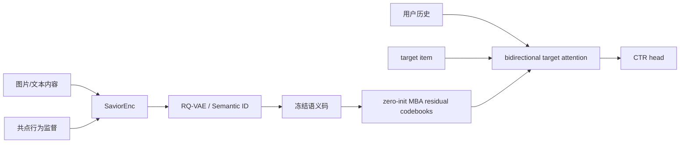

# SaviorRec：让语义冷启动表示跟上动态行为空间

> **Fidelity: 核心机制复现**。真实执行行为监督内容编码、RQ Semantic ID、零初始化 MBA 残差码本、双向 target/history attention 和 CTR 训练；MovieLens genre 替代私有图文模型。

## 论文信息

| 项目 | 内容 |
| --- | --- |
| 论文链接 | [arXiv 2508.01375](https://arxiv.org/abs/2508.01375) |
| 公司/机构 | Alibaba |
| 首次公开日期 | 2025-08-02（arXiv v1） |
| 原文开源代码 | 否：论文未提供官方/作者代码（核查日期：2026-07-15） |
| Adapter | `saviorrec` |
| 本地复现代码 | [`src/auto_research/reproductions/saviorrec/`](https://github.com/daiwk/auto-research/tree/main/src/auto_research/reproductions/saviorrec/) |

## 原始论文总结

### 背景与主要改动

冷启动排序依赖内容语义，但通用多模态 encoder 的相似度不等于平台用户的共点/共购关系，而且行为分布持续变化。SaviorRec 先以真实交互监督训练 SaviorEnc，再用 RQ-VAE 把表示离散为 Semantic ID；线上排序阶段冻结 SID，同时用零初始化的 Modal-Behavior Alignment（MBA）码本学习相对当前行为空间的残差，并用 target 与历史双向注意力完成 CTR 预测。



### 核心公式

内容 encoder 用行为正对进行对比学习；RQ 逐层量化残差：

$$
z_i=E_{content}(x_i),\quad
c_i^l=\arg\min_k\|r_i^{l-1}-e_k^l\|^2,\quad
r_i^l=r_i^{l-1}-e_{c_i^l}^l.
$$

MBA 不修改冻结 SID，而从全零码本学习动态行为残差：

$$
\tilde z_i=z_i+\sum_{l=1}^L A^l[c_i^l],\qquad A^l_0=0.
$$

随后 target 查询历史、历史也接收 target 条件，输出 CTR：

$$
u_t=\operatorname{BiTargetAttn}(\{\tilde z_{h_j}\},\tilde z_t),\qquad
\hat y=\sigma(\operatorname{MLP}[u_t,\tilde z_t,u_t\odot\tilde z_t]).
$$

### 论文离线与线上效果

原文总流量 AUC 从 Base **71.28%** 提升到 **72.11%**；交互数 `[0,100)` 的冷物品从 70.34% 提升到 71.87%。I2I Hit@30 从官方语义表示 28.56% 提升到完整方案 41.30%。

淘宝“猜你喜欢”冷启动流量线上 A/B：Clicks **+13.31%**、Orders **+13.44%**、CTR **+12.80%**。

## 本地复现

> **本地对照口径**：基线是等预算 Content Ranker；实验组是 SaviorRec；总体 AUC **+1.56%**、cold AUC **+6.92%**，但都只有 1/3 seeds 正向。这是语义—行为对齐模块消融，不是相对 DIN。

MovieLens-100K 的 genre multi-hot 是公开内容模态，时间相邻交互构造行为正对。第一阶段训练内容 encoder 后做 3 层 residual k-means；第二阶段用 chronological CTR 切分训练等预算 content baseline 与 SaviorRec。冷启动 test 定义为训练 candidate 频次最低四分位。

| Method | AUC mean ± std | Cold AUC mean ± std | seconds |
|---|---:|---:|---:|
| Content ranker | 0.586787 ± 0.014785 | 0.459877 ± 0.054957 | **3.61** |
| SaviorRec | **0.595923 ± 0.009095** | **0.491690 ± 0.083339** | 6.50 |

均值上总体 AUC 相对 **+1.56%**，冷启动 AUC 相对 **+6.92%**；但两项都只有 1/3 seeds 正向，不能声称稳定复现。3 个 seed 的 MBA 最终 L2 范数为 0.80–0.88，证明零初始化行为残差实际参与了学习。结果见 [`metrics/movielens-100k-seeds42-44.json`](metrics/movielens-100k-seeds42-44.json)。

```bash
pip install -e '.[neural-recs]'
for seed in 42 43 44; do
  AUTO_RESEARCH_SAVIOR_ENCODER_STEPS=160 AUTO_RESEARCH_SAVIOR_STEPS=180 \
  auto-research reproduce --paper saviorrec --dataset-dir data --seed "$seed"
done
```

这里没有图像原始模态，也没有淘宝生产特征，因此是核心机制复现，不把本地数值与论文 AUC 横向比较。数据、运行目录和 checkpoint 不提交 Git。
