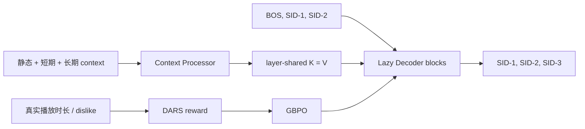

# OneRec-V2: Lazy Decoder 与真实反馈强化学习

> **Fidelity: 完整核心链路复现**。实际训练三层 residual-quantized Semantic ID、newest-impression SFT、layer-shared K/V Lazy Decoder、Duration-Aware Reward Shaping 和 GBPO；仅缩小模型/数据，省略私有异构特征与分布式 serving。

## 论文信息

| 项目 | 内容 |
| --- | --- |
| 论文链接 | [arXiv 2508.20900](https://arxiv.org/abs/2508.20900) |
| 公司/机构 | Kuaishou |
| 首次公开日期 | 2025-08-28（arXiv v1） |
| 原文开源代码 | 否：论文未提供官方/作者代码（核查日期：2026-07-15） |
| Adapter | `onerec-v2` |
| 本地复现代码 | [`src/auto_research/reproductions/onerec_v2/`](https://github.com/daiwk/auto-research/tree/main/src/auto_research/reproductions/onerec_v2/) |

## 原始论文总结

### 背景与主要改动

OneRec-V1 用 encoder-decoder 生成推荐 session，但长历史 encoder 重复计算，偏好对齐又依赖额外 reward model。V2 只把最新曝光作为监督目标；Context Processor 一次生成所有 decoder 层共享的 K/V，目标侧只解码 `[BOS,s1,s2]→[s1,s2,s3]`。Lazy block 依次执行 cross-attention、causal self-attention 和 FFN，并结合 GQA、K=V、跨层 KV sharing。后训练直接使用真实用户播放/负反馈：DARS 消除视频时长偏置，GBPO 用动态分母约束正负样本梯度而不做 PPO clipping。



### 核心公式

Newest-impression SFT 只监督窗口最后一个物品的三层 SID：

$$
\mathcal L_{SFT}=-\sum_{l=1}^{3}\log\pi_\theta(s_l\mid C,s_{<l}).
$$

DARS 先按视频时长分桶，再在同一用户、同一时长桶内计算播放时长分位数：

$$
F(d)=\lfloor\log_\beta(d+\epsilon)\rfloor,\qquad
A_i=\begin{cases}+1&q_i\ge 75\%\\-1&\text{explicit dislike}\\0&\text{otherwise.}\end{cases}
$$

GBPO 对正负优势使用不同动态分母：

$$
\mathcal L_{GBPO}=-\mathbb E\left[\frac{\pi_\theta(y\mid x)}{D(y,A)}A\right],
$$

$$
D=\begin{cases}\max(\pi_{old},\mathrm{sg}(\pi_\theta))&A>0\\
\max(\pi_{old},1-\mathrm{sg}(\pi_\theta))&A<0.\end{cases}
$$

### 论文离线与线上效果

论文 1B 模型中，Lazy Decoder loss `3.27`，与标准 encoder-decoder 的 `3.28/3.26` 相当；计算量从 `296.36/204.21 GFLOPs` 降到 **18.89 GFLOPs**。GQA 与 KV sharing 的 loss 基本不变。

线上在 Kuaishou 与 Kuaishou Lite 各 **5% 流量、持续一周**：

| Product | App stay | Watch time | Like | Follow | Forward |
|---|---:|---:|---:|---:|---:|
| Kuaishou | +0.467% | +1.367% | +3.924% | +4.730% | +3.183% |
| Kuaishou Lite | +0.741% | +0.762% | +5.393% | +5.627% | **+7.958%** |

## 本地复现

> **本地对照口径**：效率基线是 Encoder-Decoder，实验组 Lazy SFT 的延迟 **-54.78%**、validation loss **-0.34%**；对齐基线是 Lazy SFT，加入 GBPO 后反馈加权概率 **+21.66%**。这是两个阶段的内部消融，不是相对 DIN 或统一 NDCG 的比较。

首次运行自动下载 KuaiRand-Pure（压缩约 45MB、解压约 194MB），不把数据提交到 Git。使用公开 tag、author、duration 与固定 identity projection（代替私有多模态 embedding）训练 `[128,64,32]` 三层 residual-kmeans SID，唯一率 **98.52%**；60,000 条真实标准流日志生成 12,000 个按时间排序的 newest-impression 样本。64d、2-layer 模型使用 80-step SFT + 40-step GBPO。

3 seeds 汇总：

| Metric | Encoder-decoder | Lazy SFT | Lazy + GBPO |
|---|---:|---:|---:|
| Validation loss | 12.0533 ± 0.0451 | **12.0121 ± 0.0039** | — |
| ms / example | 0.2632 ± 0.0617 | **0.1190 ± 0.0193** | — |
| Feedback-weighted probability | — | 1.281e-5 ± 0.110e-5 | **1.558e-5 ± 0.272e-5** |

本机 Lazy Decoder 推理均值快 **54.78%**，validation loss 还略低 0.34%，复现了“接近质量、显著减算”的方向。GBPO 的反馈加权概率均值提升 **21.66%**，但逐 seed 为 `+29.23% / -0.46% / +35.38%`，不是稳定正向；该概率也受 SID 空间大小影响，不能与论文线上百分比直接比较。结构化结果见 [`metrics/kuairand-pure-seeds42-44.json`](metrics/kuairand-pure-seeds42-44.json)。

```bash
pip install -e '.[neural-recs]'
for seed in 42 43 44; do
  AUTO_RESEARCH_ONEREC_V2_SFT_STEPS=80 \
  AUTO_RESEARCH_ONEREC_V2_GBPO_STEPS=40 \
  AUTO_RESEARCH_ONEREC_V2_EVENTS=60000 \
  AUTO_RESEARCH_ONEREC_V2_EXAMPLES=12000 \
  auto-research reproduce --paper onerec-v2 --dataset-dir data --seed "$seed"
done
```
