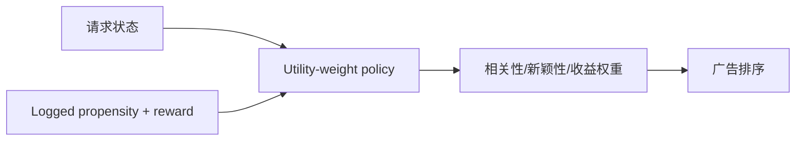
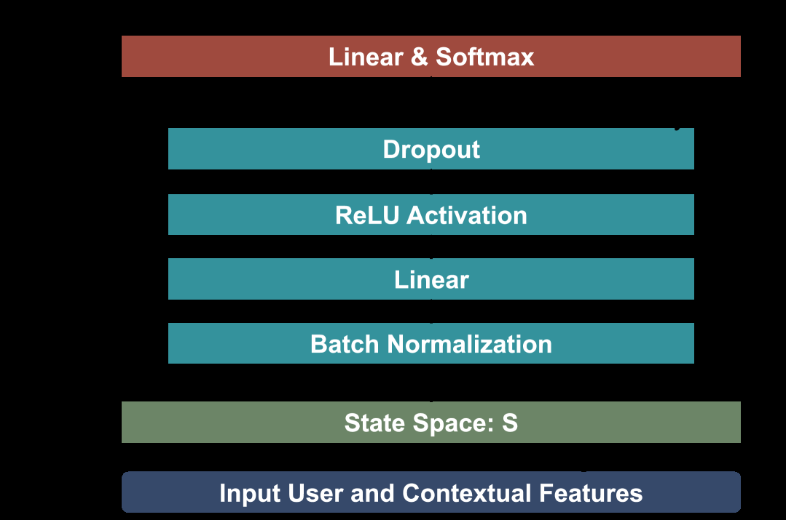

# DRL-PUT：用深度强化学习调节排序效用

> **Fidelity: 核心机制复现**。从公开交互构造带 propensity 的日志策略，并用 REINFORCE 学习效用权重动作。

## 论文信息

| 项目 | 内容 |
| --- | --- |
| 论文链接 | [arXiv 2509.05292](https://arxiv.org/abs/2509.05292) |
| 公司/机构 | Pinterest |
| 首次公开日期 | 2025-09-05（arXiv v1） |
| 原文开源代码 | 否：论文未提供官方/作者代码（核查日期：2026-08-09） |
| Adapter | `drl-put` |
| 本地复现代码 | [`src/auto_research/reproductions/drl_put/`](https://github.com/daiwk/auto-research/tree/main/src/auto_research/reproductions/drl_put/) |

## 原始论文总结

### 背景与主要改动

广告排序的相关性、CTR、CVR 和收益权重通常靠人工调节。DRL-PUT 把权重组合视为动作，依据用户/请求状态选择动作，并从 logged behavior 和组合 reward 学习策略。



<!-- paper-figure:start -->
### 原论文关键图

[](https://ar5iv.labs.arxiv.org/html/2509.05292/assets/x1.png)

> **原论文 Figure 1（关键图）**：展示原论文提出的核心架构、主要模块及其连接关系。图片来自[原论文](https://arxiv.org/abs/2509.05292)，版权归原作者所有；点击图片可查看来源。
<!-- paper-figure:end -->

### 核心公式

$$
U(i|x,a)=\sum_m a_m s_m(i,x),\qquad
\nabla J=\mathbb E\!\left[\frac{\pi(a|x)}{\mu(a|x)}
(R-b)\nabla\log\pi(a|x)\right].
$$

### 论文离线与线上效果

论文以离线 policy/value 指标筛选模型；线上平台 Revenue `+0.27%`、CTR `+1.62%`、CVR `+0.67%`，并分别披露 treated segment guardrail。

## 本地复现

> **本地对照口径**：相对固定 utility 权重基线，实验组 NDCG@10 `+19.13%`。

相对固定效用权重：NDCG@10 `0.07514→0.08951`（`+19.13%`），Hit@10 `0.14048→0.15714`，head share `0.21762→0.11048`。指标见 [`metrics/movielens-1m-seed42.json`](metrics/movielens-1m-seed42.json)。

```bash
auto-research reproduce --paper drl-put --dataset-dir data --seed 42
```

## 复现边界

公开评分代理点击和收益，无法重建 Pinterest 拍卖、真实 counterfactual reward 与广告主约束。
