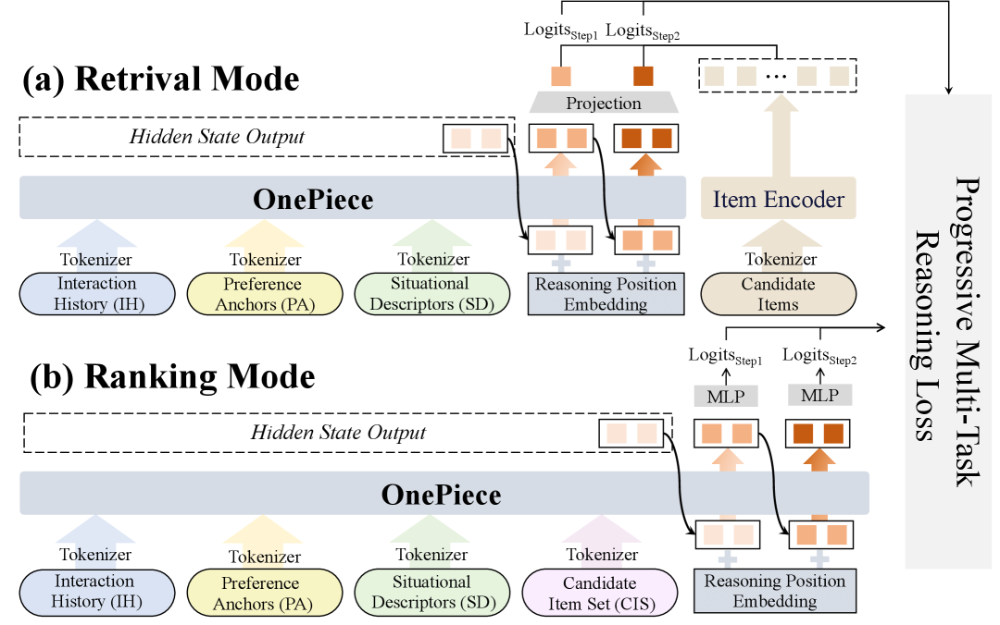

# OnePiece: Bringing Context Engineering and Reasoning to Industrial Cascade Ranking

> **保真度：核心机制复现**。原文结论、本地公开数据实验和未复刻部分分开陈述。

## 论文信息

| 项目 | 内容 |
| --- | --- |
| 论文链接 | [arXiv 2509.18091](https://arxiv.org/abs/2509.18091) |
| 公司/机构 | Shopee |
| 首次公开日期 | 2025-09-22（arXiv v1） |
| 原文开源代码 | 否：论文未提供官方/作者代码（核查日期：2026-08-09） |
| Adapter | `onepiece` |
| 本地复现代码 | [`src/auto_research/reproductions/onepiece/`](https://github.com/daiwk/auto-research/tree/main/src/auto_research/reproductions/onepiece/) |

## 原始论文总结

### 背景与主要改动

把上下文 token、块级 latent reasoning 与递进多任务目标合并到级联排序器，让召回、点击和价值任务共享表示但分阶段收敛。


<!-- paper-figure:start -->
### 原论文关键图

[](https://ar5iv.labs.arxiv.org/html/2509.18091/assets/x2.png)

> **原论文 Figure 2（关键图）**：展示原论文提出的核心架构、主要模块及其连接关系。图片来自[原论文](https://arxiv.org/abs/2509.18091)，版权归原作者所有；点击图片可查看来源。
<!-- paper-figure:end -->

### 核心公式

$$
H^{k+1}=H^k+F_k(H^k,c),\quad\mathcal L=\sum_t\alpha_t(k)\mathcal L_t.
$$

### 论文离线与线上效果

Shopee GMV/UU 超过 +2%，广告收入 +2.90%。

## 本地复现

> **本地对照口径**：基线为共享 transition + content scorer，实验组只加入 `onepiece` 核心机制；相对 NDCG@10 +22.87%。

MovieLens-100K、260 users / 420 items、seed 42：NDCG@10 0.0354 → **0.0435（+22.87%）**。基线是共享 transition + content scorer；实验组只加入论文核心路径。

```bash
auto-research reproduce --paper onepiece --dataset-dir data --seed 42
auto-research evolve --model rankmixer --dataset movielens-100k --direction "组合 onepiece 与已安装论文算子" --generations 2 --population 4
```

固定指标见 [`metrics/public-seed42.json`](metrics/public-seed42.json)。

## 复现边界

在 MovieLens-100K 全库排序上实际执行论文核心状态、训练目标或推理路径；未使用公司私有特征、生产流量和在线服务，线上 A/B 数字只引用原文。 本地数值不等同于原论文大模型、私有数据、生产流量或专用 kernel；本地相对变化不得与原文提升混写。
