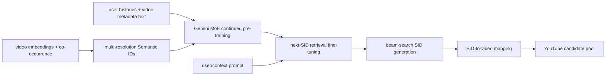

# PLUM: Pre-trained LLM for industrial generative retrieval

> **Fidelity: 完整核心链路复现**。本地实际执行多层 RQ Semantic ID、预训练 decoder-only LM 的 CPT、next-SID SFT 和 token-level constrained beam search；只缩小模型/数据规模并替换私有模态。

- 论文：[arXiv 2510.07784](https://arxiv.org/abs/2510.07784)，Google DeepMind / YouTube
- Adapter：`plum`；代码：`src/auto_research/reproductions/plum/`
- 本地数据：MovieLens-1M；运行：`auto-research reproduce --paper plum --seed 42`

## 原始论文总结

### 背景与主要改动

传统 large embedding model（LEM）把绝大多数参数放在千万级 ID embedding 表，神经网络容量反而很小，难以获得 LLM 式 scaling。PLUM 从 Gemini-1.5 MoE 初始化，把视频量化成 Semantic ID（SID），先用用户行为与视频文本/ASR/频道元数据做 continued pre-training（CPT），再以 next-SID generation 做生成式召回。线上用 beam search 直接生成候选 SID，不再维护点积检索索引。



### 核心公式

Residual quantization 逐层生成 SID。令 $r_i^1=e_i$，第 $l$ 层 code 与残差为

$$s_i^l=\arg\min_k\|r_i^l-c_k^l\|_2^2,\qquad r_i^{l+1}=r_i^l-c_{s_i^l}^l.$$

SID-v2 联合训练重构、RQ commitment/codebook 和 co-occurrence contrastive loss：

$$\mathcal L_{SID}=\mathcal L_{recon}+\sum_l\left(\beta\|r_l-\mathrm{sg}[e_l]\|_2^2+\|\mathrm{sg}[r_l]-e_l\|_2^2\right)+\lambda\mathcal L_{con}.$$

训练时为每个样本随机选择深度 $r\in[1,L]$，只重构前 $r$ 层 codeword 之和，以 progressive masking 强化层级结构。

CPT 在混合 token 上学习自回归目标；召回 SFT 对目标视频 SID 计算

$$\mathcal L_{retrieval}=-\sum_{l=1}^{L}\log P(s_{click}^l\mid prompt,s_{click}^{<l}).$$

本质变化是把容量从 $O(|V|d)$ ID 表转移到可 scaling 的 Transformer/MoE 参数，并通过 CPT 对齐语言空间与协同空间。

### 论文离线与线上效果

900M activated-parameter MoE 相对生产 LEM：LFV/Shorts effective vocabulary 为 2.60×/13.24×，CTR ratio 为 1.42×/1.33×。SIDv2 相对 SIDv1 将唯一率 94.0%→96.7%，Video Recall@10 12.3%→14.4%。8th-day Recall@10 从随机初始化无 CPT 的 0.19，提高到 LLM 初始化 + CPT 的 **0.28**。

YouTube live experiment 将 PLUM 候选加入现有池，并给 LEM+ 相同新增 quota：

| Metric | LFV | Shorts |
|---|---:|---:|
| Engaged users | +0.07% | +0.28% |
| Panel CTR | +0.76% | +4.96% |
| Views | +0.80% | +0.39% |
| Satisfaction | +0.06% | +0.39% |

## 本地复现

> **本地对照口径**：基线是随机初始化无 CPT（R1），实验组是随机初始化有 CPT（CR1）；Recall@10 都是 0.0050（**0.00%**），但 SFT final loss 从 3.5023 降至 2.5933；LLM 初始化的 R2/CR2 Recall 均为 0。这里验证的是 CPT 收敛，不是相对 DIN，也没有验证最终召回提升。

这次不再使用旧的检索打分融合代理。MovieLens-1M 上实际执行以下链路：

1. title hashed-TF-IDF 与 genre 作为两种公开内容模态；相邻观看作为 contrastive positive，训练 RQ-VAE。
2. 三层 codebook `[512, 256, 128]`，训练时 progressive masking；每个 codeword 注册为 tokenizer 中独立 SID token。
3. CPT 语料严格按 50% 用户行为序列、50% SID + title/genre metadata 混合。
4. SmolLM2-135M 做全参数训练，不使用 LoRA。按原文跑 R1/R2/CR1/CR2 四组消融。
5. SFT prompt loss 全部 mask，只对下一物品的三个 SID token 与结束 token 计算交叉熵。
6. 测试时逐 token beam search，并用 catalog trie 限制每个 prefix 的合法后继；不是先算全量 item score 再融合。

最终纳入报告的干净运行统一使用 CPT 240 step、SFT 240 step、batch 16、constant LR `1e-4`、beam 10、固定 200 名测试用户。`1e-4` 对齐论文 Table 6 的约 110M 模型设置；一次 `5e-5` 尝试因同阶段收敛明显更慢而停止，未混入最终四组比较。

### 本地结果

| Variant | LLM init | CPT | CPT final loss | SFT final loss | Recall@10 | NDCG@10 |
|---|:---:|:---:|---:|---:|---:|---:|
| R1 | no | no | — | 3.5023 | **0.0050** | 0.0019 |
| R2 | yes | no | — | 3.7209 | 0.0000 | 0.0000 |
| CR1 | no | yes | 2.6366 | **2.5933** | **0.0050** | **0.0050** |
| CR2 | yes | yes | 2.7961 | 3.1686 | 0.0000 | 0.0000 |

三层 SID 唯一率 **98.33%**，四组 constrained generation 的 valid SID rate 均为 **100%**。CPT 对随机初始化组显著改善优化：SFT final loss 从 3.5023 降到 2.5933，但 Recall@10 同为 0.0050，没有转化为召回提升。LLM 初始化组在有无 CPT 时 Recall@10 都为 0，未复现论文中 LLM initialization 的增益。

200 用户上一个 hit 就对应 0.005 Recall，指标分辨率较粗，因此结论只能是：**本地验证了 CPT 的收敛收益，没有验证 CPT 或 LLM 初始化的最终召回收益**。旧的 `NDCG@10 +24.62%` 已撤回，因为它来自 heuristic fusion，不是 PLUM。结构化原始指标保存在 [`metrics/movielens-1m-seed42.json`](metrics/movielens-1m-seed42.json)。

一次 240 → 1,000 step 的早期续训结果未纳入报告：当时的 checkpoint 没有固化 `semantic_ids.npy`，重建 SID 后唯一率由 98.33% 漂移到 98.54%，无法保证续训前后 token 语义严格一致。当前实现已把 SID 映射与模型一起保存，并在续训时强制从上一次结果恢复；但为了结果口径干净，表格只保留漂移发生前的单次完整运行。

本地仍然缩小了规模：135M dense LM 替代 Gemini-1.5 MoE，MovieLens title/genre 替代 YouTube 文本/ASR/多模态 embedding，千级 optimizer steps 替代 260B-token CPT。缩放不会删除论文的 SID 训练、CPT、SFT 或生成推理阶段。

### 完整复现命令

```bash
python3 -m venv .auto-research/plum-venv
source .auto-research/plum-venv/bin/activate
pip install -e '.[plum]'

AUTO_RESEARCH_PLUM_CHECKPOINTS=runs/plum-checkpoints/seed-42 \
auto-research reproduce \
  --paper plum \
  --dataset-dir data \
  --output-dir runs/reproductions \
  --seed 42
```

默认即为上表的 CPT 240 / SFT 240 / batch 16 / 200-user evaluation。MovieLens-1M 首次运行自动下载。checkpoint、数据和原始运行产物仅保存在被 Git 忽略的 `.auto-research/`、`runs/`、`data/` 中；MR 只提交代码、测试、结构化指标与本节结论。

如果希望从头进行更长但仍严格一致的实验，请不要续接旧 checkpoint，而是换一个空目录一次性训练 1,000 step：

```bash
AUTO_RESEARCH_PLUM_SFT_STEPS=1000 \
AUTO_RESEARCH_PLUM_CHECKPOINTS=runs/plum-checkpoints/seed-42-sft1000-clean \
auto-research reproduce --paper plum --dataset-dir data --seed 42
```

快速链路检查可显式缩小配置，但其结果不能写入正式结论：

```bash
AUTO_RESEARCH_PLUM_CPT_STEPS=1 \
AUTO_RESEARCH_PLUM_SFT_STEPS=1 \
AUTO_RESEARCH_PLUM_EVAL_USERS=2 \
auto-research reproduce --paper plum --seed 42
```
