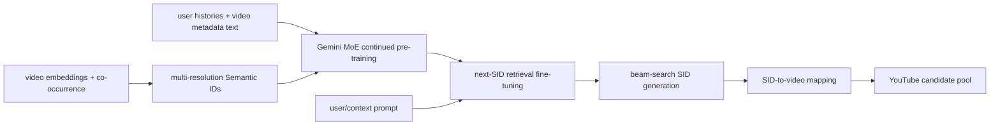

# PLUM: Pre-trained LLM for industrial generative retrieval

- 论文：[arXiv 2510.07784](https://arxiv.org/abs/2510.07784)，Google DeepMind / YouTube
- Adapter：`plum`；代码：`src/auto_research/reproductions/plum/`
- 本地数据：MovieLens-1M；运行：`auto-research reproduce --paper plum --seed 42`

## 原始论文总结

### 背景与主要改动

传统 large embedding model（LEM）把绝大多数参数放在千万级 ID embedding 表，神经网络容量反而很小，难以获得 LLM 式 scaling。PLUM 从 Gemini-1.5 MoE 初始化，把视频量化成 Semantic ID（SID），先用用户行为与视频文本/ASR/频道元数据做 continued pre-training（CPT），再以 next-SID generation 做生成式召回。线上用 beam search 直接生成候选 SID，不再维护点积检索索引。

### 核心公式

Residual quantization 逐层生成 SID。令 $r_i^1=e_i$，第 $l$ 层 code 与残差为

$$s_i^l=\arg\min_k\|r_i^l-c_k^l\|_2^2,\qquad r_i^{l+1}=r_i^l-c_{s_i^l}^l.$$

CPT 在混合 token 上学习自回归目标；召回 SFT 对目标视频 SID 计算

$$\mathcal L_{retrieval}=-\sum_{l=1}^{L}\log P(s_{click}^l\mid prompt,s_{click}^{<l}).$$

本质变化是把容量从 $O(|V|d)$ ID 表转移到可 scaling 的 Transformer/MoE 参数，并通过 CPT 对齐语言空间与协同空间。

### 论文离线与线上效果

900M activated-parameter MoE 相对生产 LEM：LFV/Shorts effective vocabulary 为 2.60×/13.24×，CTR ratio 为 1.42×/1.33×。SIDv2 相对 SIDv1 将唯一率 94.0%→96.7%，Video Recall@10 12.3%→14.4%。8th-day Recall@10 从随机初始化无 CPT 的 0.19，提高到 LLM 初始化 + CPT 的 **0.28**。

YouTube live experiment 将 PLUM 候选加入现有池，并给 LEM+ 相同新增 quota：

| Metric | LFV | Shorts |
|---|---:|---:|
| Engaged users | +0.07% | +0.28% |
| Panel CTR | +0.76% | +4.96% |
| Views | +0.80% | +0.39% |
| Satisfaction | +0.06% | +0.39% |

## 本地复现

MovieLens-1M 上以 genre 构造 18 个公开 SID，使用行为转移学习 domain co-occurrence prior，再与 100K-transition 轻量检索 backbone 融合；semantic weight 只由 validation 选择，test 做 full-catalog 排序。

| Retrieval | Hit@10 | NDCG@10 |
|---|---:|---:|
| Large-embedding retrieval proxy | 0.0358 | 0.0181 |
| PLUM semantic-ID generation proxy | **0.0452** | **0.0225** |

NDCG@10 **+24.62%**。结果支持“语义 code + domain pretraining prior”在公开数据上的价值，但不等价于 Gemini MoE、260B-token CPT、文本 token、beam search 或十亿视频 serving。
