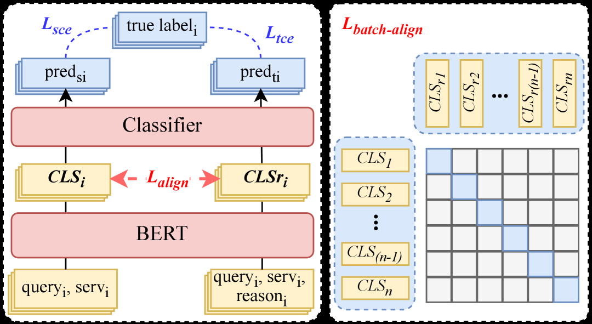

# From Reasoning LLMs to BERT: A Two-Stage Distillation Framework for Search Relevance

> **保真度：核心机制复现**。原文结论、本地公开数据实验和未复刻部分分开陈述。

## 论文信息

| 项目 | 内容 |
| --- | --- |
| 论文链接 | [TheWebConf 2026 Industry](https://arxiv.org/abs/2510.11056) |
| 公司/机构 | Meituan |
| 首次公开日期 | 2025-10-13（arXiv v1） |
| 原文开源代码 | 否：论文未提供官方/作者代码（核查日期：2026-08-09） |
| Adapter | `crsd` |
| 本地复现代码 | [`src/auto_research/reproductions/crsd/`](https://github.com/daiwk/auto-research/tree/main/src/auto_research/reproductions/crsd/) |

## 原始论文总结

### 背景与主要改动

先以 CPT、SFT 和多维偏好优化构建领域 reasoning LLM，再让同一轻量学生的普通输入与 reasoning-augmented 输入做对比式自蒸馏，线上无需推理链。


<!-- paper-figure:start -->
### 原论文关键图

[](https://ar5iv.labs.arxiv.org/html/2510.11056/assets/x3.png)

> **原论文 Figure 3（关键图）**：展示原论文提出的核心架构、主要模块及其连接关系。图片来自[原论文](https://arxiv.org/abs/2510.11056)，版权归原作者所有；点击图片可查看来源。
<!-- paper-figure:end -->

### 核心公式

$$
\mathcal L=\mathcal L_{label}+\lambda D_{KL}(p_s(\cdot|x,r)\Vert p_s(\cdot|x))+\gamma\mathcal L_{con}.
$$

### 论文离线与线上效果

Meituan 搜索广告 30% 流量：AdCTR +0.91%、AdCVR +1.06%、GTV +0.40%，bad case -30.5 个百分点。

## 本地复现

> **本地对照口径**：基线为 `shared transition + content baseline`，实验组为 `CRSD`，只改变论文核心机制；`ndcg_at_10` 0.0354 → **0.0346，相对基线 -2.14%**。

```bash
auto-research reproduce --paper crsd --dataset-dir data --seed 42
```

固定指标见 [`metrics/public-seed42.json`](metrics/public-seed42.json)。

## 复现边界

在 MovieLens-100K 全库排序上执行论文的候选相关检索、层级压缩或蒸馏目标；未使用公司私有日志与线上 serving，线上 A/B 只引用原文。 本地相对变化不得与原文指标混写。
