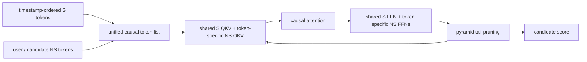

# OneTrans: One causal Transformer for sequence and feature interaction

> **Fidelity: 完整核心链路复现**。本地执行 unified S/NS tokenization、mixed QKV、mixed FFN、causal attention 和 pyramid tail pruning；持久化跨请求 KV 服务系统未复刻。

## 论文信息

| 项目 | 内容 |
| --- | --- |
| 论文链接 | [arXiv 2510.26104](https://arxiv.org/abs/2510.26104) |
| 公司/机构 | ByteDance |
| 首次公开日期 | 2025-10-30（arXiv v1） |
| 原文开源代码 | 否：论文未提供官方/作者代码（核查日期：2026-07-22） |
| Adapter | `onetrans` |
| 本地复现代码 | [`src/auto_research/reproductions/onetrans/`](https://github.com/daiwk/auto-research/tree/main/src/auto_research/reproductions/onetrans/) |

## 原始论文总结

### 背景与主要改动

OneTrans 把行为 S-tokens 放在异构 NS-tokens 前，使用一个 causal Transformer 同时完成序列建模和字段交互。语义同质的 S-token 共享 QKV/FFN；每个 NS-token 拥有独立参数。因果顺序使 NS-token 能读取完整历史，pyramid stack 逐层只保留近期 S queries。线上用 cross-candidate/cross-request KV cache 复用 S-side 计算。



### 核心公式

$$
X^{(0)}=[S\text{-tokens};NS\text{-tokens}],
$$

$$
W_i^{Q,K,V}=\begin{cases}W_S^{Q,K,V}&i\le L_S\\W_{NS,i}^{Q,K,V}&i>L_S,\end{cases}
$$

$$
X^{(n)}=\operatorname{MixedFFN}(\operatorname{Norm}(Z^{(n)}))+Z^{(n)}.
$$

### 论文离线与线上效果

论文 OneTrans-L 相对 DCNv2+DIN 的 CTR AUC/UAUC 为 `+1.53%/+2.79%`，CVR AUC/UAUC 为 `+1.14%/+3.23%`。线上 Feeds order/U `+4.3510%`、GMV/U `+5.6848%`、p99 latency `-3.91%`；Mall GMV/U `+3.6696%`。

## 本地复现

> **本地对照口径**：基线是独立 sequence encoder 后与 candidate 交互的 Encode-then-Interact；实验组是 OneTrans；NDCG@10 从 0.0069 升至 0.0154（**+123.58%**），但 head share 达 92%。这是统一架构相对 stacked 架构的消融，不是相对 DIN。

MovieLens-100K，64d、2 layers、32 S-tokens、2 NS-tokens，240 step、三个 seed；对照是独立 sequence encoder 后再与 candidate features 交互。

| Architecture | Hit@10 | NDCG@10 | Head share@10 |
|---|---:|---:|---:|
| Encode then interact | 0.0154 ± 0.0043 | 0.0069 ± 0.0022 | 0.3374 |
| OneTrans | **0.0304 ± 0.0035** | **0.0154 ± 0.0034** | 0.9200 |

NDCG 相对 `+123.58%`，但 **92.0%** 推荐来自 popularity top 10%。当前公开小数据上 unified causal block 学到了强流行度捷径；因此结果验证模型可训练和方向性提升，却没有验证论文所声称的泛化质量。后续应增加 sampled-popularity correction 或更丰富的 user/item/context 字段。

结构化指标：[metrics/movielens-100k-seed42.json](metrics/movielens-100k-seed42.json)。

```bash
auto-research reproduce --paper onetrans --dataset-dir data --seed 42
```

原始运行结果只保存在被 Git 忽略的 `runs/`。
