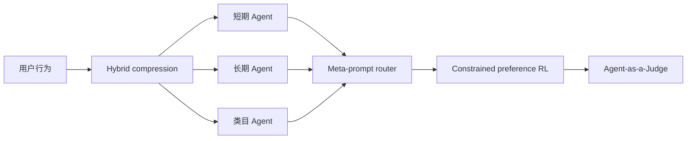
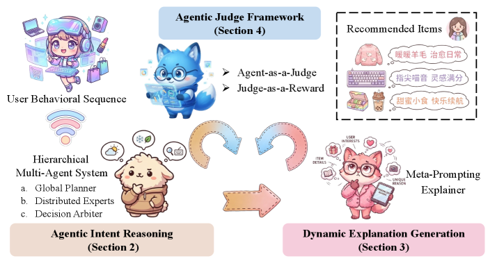

# RecGPT-V2：层级多 Agent 用户意图推理

> **Fidelity: 核心机制复现**。实际执行短期/长期/类目 agent、meta-router、混合表示与 KL 约束偏好更新。

## 论文信息

| 项目 | 内容 |
| --- | --- |
| 论文链接 | [arXiv 2512.14503](https://arxiv.org/abs/2512.14503) |
| 公司/机构 | Alibaba / Taobao |
| 首次公开日期 | 2025-12-16（arXiv v1） |
| 原文开源代码 | 否：论文未提供官方/作者代码（核查日期：2026-08-09） |
| Adapter | `recgpt-v2` |
| 本地复现代码 | [`src/auto_research/reproductions/recgpt_v2/`](https://github.com/daiwk/auto-research/tree/main/src/auto_research/reproductions/recgpt_v2/) |

## 原始论文总结

### 背景与主要改动

RecGPT-V1 的多条固定推理链重复且难泛化。V2 用层级多 Agent 拆解意图，混合压缩行为表示，动态生成 meta-prompt，再用多奖励约束 RL 和 Agent-as-a-Judge 对齐。



<!-- paper-figure:start -->
### 原论文关键图

[](https://ar5iv.labs.arxiv.org/html/2512.14503/assets/x2.png)

> **原论文 Figure 2（关键图）**：展示原论文提出的核心架构、主要模块及其连接关系。图片来自[原论文](https://arxiv.org/abs/2512.14503)，版权归原作者所有；点击图片可查看来源。
<!-- paper-figure:end -->

### 核心公式

$$
\pi(a\mid h)=\sum_k g_k(h)\pi_k(a\mid h),\qquad
\max_\pi\ \mathbb E[R]-\beta D_{\mathrm{KL}}(\pi\Vert\pi_0).
$$

### 论文离线与线上效果

论文报告 exclusive recall `9.39%→10.99%`、GPU 消耗 `-60%`、tag prediction `+24.1%`、explanation acceptance `+13.0%`。淘宝线上 CTR `+2.98%`、IPV `+3.71%`、TV `+2.19%`、NER `+11.46%`。

## 本地复现

> **本地对照口径**：相对 RecGPT-V1 单路兴趣基线，实验组 NDCG@10 `+18.52%`。

相对单路 RecGPT-V1 代理：Hit@10 `0.14048→0.14762`，NDCG@10 `0.07514→0.08905`（`+18.52%`），head share `0.21762→0.18167`。指标见 [`metrics/movielens-1m-seed42.json`](metrics/movielens-1m-seed42.json)。

```bash
auto-research reproduce --paper recgpt-v2 --dataset-dir data --seed 42
```

## 复现边界

Agent 是公开数据上的可训练小型专家，不是淘宝私有 LLM；没有人工 Judge 标注、解释生成或线上资源测量。
