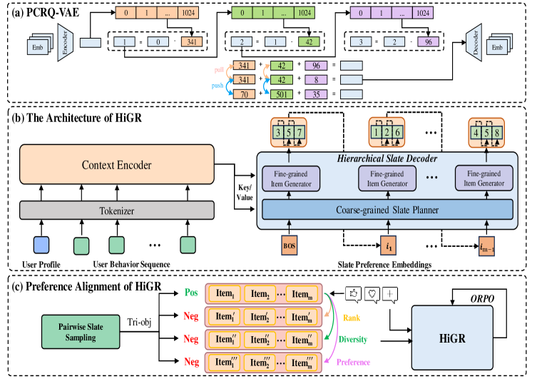

# HiGR：层级生成式 Slate 推荐

> **Fidelity: 核心机制复现**。实际学习两级 residual semantic ID，执行 coarse-to-fine slate 解码和 ORPO 风格偏好重排。

## 论文信息

| 项目 | 内容 |
| --- | --- |
| 论文链接 | [arXiv 2512.24787](https://arxiv.org/abs/2512.24787) |
| 公司/机构 | Tencent |
| 首次公开日期 | 2025-12-31（arXiv v1） |
| 原文开源代码 | 否：论文未提供官方/作者代码（核查日期：2026-08-09） |
| Adapter | `higr` |
| 本地复现代码 | [`src/auto_research/reproductions/higr/`](https://github.com/daiwk/auto-research/tree/main/src/auto_research/reproductions/higr/) |

## 原始论文总结

### 背景与主要改动

逐物品生成忽略 slate 内相互作用。HiGR 用 PCRQ-VAE 得到层级语义 ID，Hierarchical Slate Decoder 先选簇再选物品，并通过 ORPO 对齐整页偏好。


<!-- paper-figure:start -->
### 原论文关键图

[](https://arxiv.org/html/2512.24787v5/x1.png)

> **原论文 Figure 1（关键图）**：展示原论文提出的核心架构、主要模块及其连接关系。图片来自[原论文](https://arxiv.org/abs/2512.24787)，版权归原作者所有；点击图片可查看来源。
<!-- paper-figure:end -->

### 核心公式

$$
i\mapsto(c_i^{(1)},c_i^{(2)}),\qquad
\mathcal L_{\mathrm{ORPO}}=-\log p(y^+|x)
-\lambda\log\sigma(\logit p(y^+|x)-\logit p(y^-|x)).
$$

### 论文离线与线上效果

论文在公开 KuaiRec 与腾讯数据报告层级生成和 ORPO 优于 flat generator；线上 5% 流量 stay time `+1.03%`、watch time `+1.22%`、video views `+1.73%`、request count `+1.57%`。

## 本地复现

> **本地对照口径**：相对 flat item slate 基线，实验组 NDCG@10 `-12.32%`。

MovieLens-1M 上 NDCG@10 `0.07514→0.06588`（`-12.32%`），head share `0.21762→0.15714`。多样性更好但精度下降，未复现线上收益。指标见 [`metrics/movielens-1m-seed42.json`](metrics/movielens-1m-seed42.json)。

```bash
auto-research reproduce --paper higr --dataset-dir data --seed 42
```

## 复现边界

MovieLens 单物品 next-item 目标并非视频 slate 反馈；本地 k-means residual ID 不等价于生产 PCRQ-VAE。
