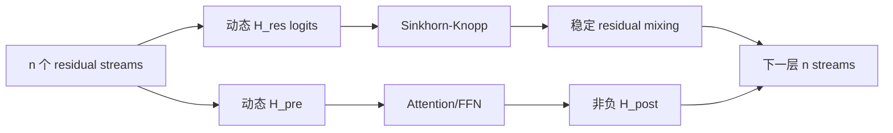

# mHC：流形约束超连接

> **Fidelity: 核心机制复现**。在小型 causal Transformer 中实际训练动态两流 HC/mHC，对残差映射做 20 次 Sinkhorn-Knopp，并测量行列约束与谱范数。

## 论文信息

| 项目 | 内容 |
| --- | --- |
| 论文链接 | [arXiv 2512.24880](https://arxiv.org/abs/2512.24880) |
| 公司/机构 | DeepSeek-AI |
| 首次公开日期 | 2025-12-31（arXiv v1） |
| 原文开源代码 | 否：论文未提供官方/作者代码（核查日期：2026-07-15） |
| Adapter | `mhc` |
| 本地复现代码 | [`src/auto_research/reproductions/mhc/`](https://github.com/daiwk/auto-research/tree/main/src/auto_research/reproductions/mhc/) |

## 原始论文总结

### 背景与主要改动

Hyper-Connections 把单一 residual stream 扩为多个流并动态混合，但任意残差矩阵会破坏 identity mapping，深层组合可能放大信号。mHC 将 $H^{res}$ 投影到 Birkhoff polytope（非负、行列和均为 1），同时约束 $H^{pre}$、$H^{post}$ 非负；这样既保留跨流信息交换，又让每层残差映射非扩张。论文另提供融合 kernel、activation 重计算和 DualPipe 重叠以控制系统开销。



### 核心公式

$$
x_{l+1}=H_l^{res}x_l+H_l^{post}\,F(H_l^{pre}x_l;W_l),
$$

$$
H_l^{res}=\operatorname{Sinkhorn}(\widetilde H_l^{res}),\quad
H_l^{res}\mathbf 1=\mathbf 1,\quad \mathbf 1^\top H_l^{res}=\mathbf 1^\top,\quad H_l^{res}\ge0.
$$

### 论文离线与线上效果

论文在 3B、9B、27B DeepSeek-V3 架构上报告 mHC 相对基线的关键 benchmark 增益约 `2.1%–2.3%`；优化后的训练额外开销为 `6.7%`。这是基础模型架构论文，没有生产线上 A/B。

## 本地复现

> **本地对照口径**：基线是同 token、优化器和主干宽度的普通 Transformer；实验组 mHC validation PPL `468.903→472.031`，变化 **`-0.67%`**（未验证效果提升），但残差谱范数 `1.0892→1.0000`、行列和最大误差 `~0.11→0`。

WikiText-2 使用 180k train tokens、24k validation tokens、BPE-1024、3 layers、64 hidden、45 steps。HC PPL `471.796`，mHC `472.031`；短训练下三者语言建模差异很小，但 mHC 的几何约束严格成立。稳定指标见 [`metrics/wikitext2-seed42.json`](metrics/wikitext2-seed42.json)。

```bash
pip install -e '.[llm-evolution]'
auto-research reproduce --paper mhc --seed 42 --device auto
```

## 复现边界

未复刻 3B/9B/27B MoE、超深训练、TileLang 融合 kernel、分段重计算和 DualPipe；小模型只验证 mHC 数学路径与短程训练，不声称复现论文规模收益。
