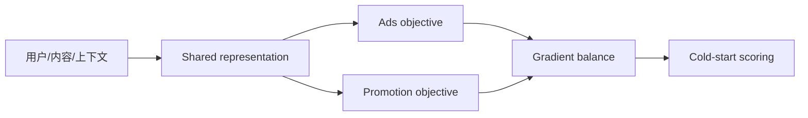

# Spotify Podcast：冷启动广告与推广多任务学习

> **Fidelity: 核心机制复现**。执行 shared low-rank multi-task representation 和冷物品分桶。

## 论文信息

| 项目 | 内容 |
| --- | --- |
| 论文链接 | [arXiv 2601.02306](https://arxiv.org/abs/2601.02306) |
| 公司/机构 | Spotify |
| 首次公开日期 | 2026-01-05（arXiv v1） |
| 原文开源代码 | 否：论文未提供官方/作者代码（核查日期：2026-07-28） |
| Adapter | `podcast-mtl` |
| 本地复现代码 | [`src/auto_research/reproductions/podcast_mtl/`](https://github.com/daiwk/auto-research/tree/main/src/auto_research/reproductions/podcast_mtl/) |

## 原始论文总结

### 背景与主要改动

新 podcast 缺少广告点击与播放数据。论文联合训练 ads 和 organic promotions，共享 user/content/context 表征，从数据丰富任务迁移到冷启动任务，并以不平衡处理和梯度平衡抑制 negative transfer。



### 核心公式

$$
\mathcal L=\alpha\mathcal L_{\mathrm{ads}}+
(1-\alpha)\mathcal L_{\mathrm{promotion}},\qquad
h=W_sx,\quad \hat y_t=W_th.
$$

### 论文离线与线上效果

effective cost per stream 最多 `-22%`，podcast stream rate `+18%` 至 `+24%`，冷内容收益更明显。

## 本地复现

> **本地对照口径**：基线是 single-task popularity/content ranker；实验组联合 organic/promotion 两任务，NDCG@10 `0.03540→0.02810`，相对 **-20.63%**，本地出现 negative transfer。

该负结果按原样保留，说明代理任务与权重需要继续进 evolve。见 [`metrics/movielens-seed42.json`](metrics/movielens-seed42.json)。

```bash
auto-research reproduce --paper podcast-mtl --dataset-dir data --seed 42
```

## 复现边界

MovieLens 电影与 genre 代理 podcast/ad 特征，没有 Spotify impression、bid 和曝光校准日志。
