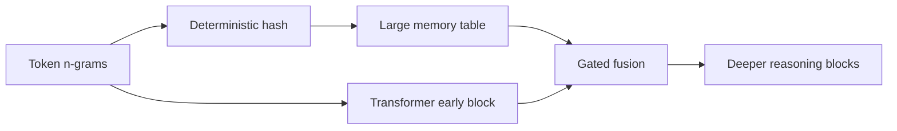
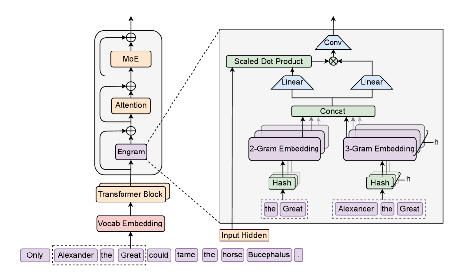

# Engram：用可扩展查表引入条件记忆

> **Fidelity: 核心机制复现**。真实训练 hashed n-gram memory、门控融合，并接入 LLM evolve。

## 论文信息

| 项目 | 内容 |
| --- | --- |
| 论文链接 | [arXiv 2601.07372](https://arxiv.org/abs/2601.07372) |
| 公司/机构 | DeepSeek |
| 首次公开日期 | 2026-01-12（arXiv v1） |
| 原文开源代码 | 是：[官方/作者代码](https://github.com/deepseek-ai/Engram) |
| Adapter | `engram` |
| 本地复现代码 | [`src/auto_research/reproductions/engram/`](https://github.com/daiwk/auto-research/tree/main/src/auto_research/reproductions/engram/) |

## 原始论文总结

### 背景与主要改动

MoE 只增加条件计算，模型仍需用计算层反复重建静态局部模式。Engram 把规范化 n-gram 哈希到大 embedding table，进行确定性的 $O(1)$ lookup，并在早期层门控注入，让 attention/FFN 留给组合推理。



<!-- paper-figure:start -->
### 原论文关键图

[](https://arxiv.org/html/2601.07372v2/x1.png)

> **原论文 Figure 1（关键图）**：展示原论文提出的核心架构、主要模块及其连接关系。图片来自[原论文](https://arxiv.org/abs/2601.07372)，版权归原作者所有；点击图片可查看来源。
<!-- paper-figure:end -->

### 核心公式

$$
a_t=\operatorname{Hash}(x_{t-n+1:t})\bmod B,\quad
m_t=E[a_t],\quad
h_t'=h_t+\sigma(W[h_t;m_t])\odot m_t.
$$

### 论文离线与线上效果

论文相对纯计算稀疏模型在 MMLU `+3.4`、BBH `+5.0`、HumanEval `+3.0`，预取后运行开销低于 `3%`；纯 LLM 论文不适用线上 A/B 门槛。

## 本地复现

> **本地对照口径**：基线是同预算 `llama_modern`；实验组加入 4096-bucket trigram memory，WikiText-2 LM loss `5.7471→6.1533`，相对 **+7.07%**（更差），PPL `313.27→470.27`。

30-step 短预算不足以训练新增 27 万 memory 参数，负结果提示 evolve 应联动预算/容量。见 [`metrics/wikitext2-seed42.json`](metrics/wikitext2-seed42.json)。

```bash
auto-research reproduce --paper engram --dataset-dir data --seed 42
auto-research evolve --model micro-llm --dataset wikitext-2 --direction "比较 Engram 条件记忆"
```

## 复现边界

未执行 27B/MoE 规模预训练、分布式表和异步预取；本地验证的是可学习查表路径，而非论文 benchmark 复刻。
