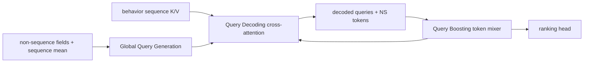

# HyFormer: Bidirectional sequence-feature co-evolution

> **Fidelity: 完整核心链路复现**。本地逐层执行 Query Generation、Query Decoding 和 Query Boosting；私有多行为序列替换为 MovieLens 单序列。

## 论文信息

| 项目 | 内容 |
| --- | --- |
| 论文链接 | [arXiv 2601.12681](https://arxiv.org/abs/2601.12681) |
| 公司/机构 | ByteDance / Douyin Search |
| 首次公开日期 | 2026-01-19（arXiv v1） |
| 原文开源代码 | 否：论文未提供官方/作者代码（核查日期：2026-07-15） |
| Adapter | `hyformer` |
| 本地复现代码 | [`src/auto_research/reproductions/hyformer/`](https://github.com/daiwk/auto-research/tree/main/src/auto_research/reproductions/hyformer/) |

## 原始论文总结

### 背景与主要改动

LONGER→RankMixer 类串行架构先压缩长序列、再做异构字段交互，信息流晚且单向。HyFormer 从非序列字段和 sequence mean 生成 Global Queries，每层用 queries cross-attend 当前 sequence K/V，再把 decoded queries 与非序列 tokens 做 RankMixer-style boosting；boosted queries 进入下一层重新解码，实现双向、逐层共同演化。



### 核心公式

$$
Q^{(0)}=[\mathrm{FFN}_1(Global),\ldots,\mathrm{FFN}_N(Global)],
$$

$$
\widehat Q^{(l)}=\operatorname{CrossAttn}(Q^{(l-1)},K^{(l)},V^{(l)}),
$$

$$
Q^{(l)}=Q+\operatorname{PerTokenFFN}(\operatorname{TokenMix}(Q)).
$$

### 论文离线与线上效果

论文在工业数据上相对 baseline AUC 约 `+0.74%`；Douyin Search 线上 watch time/U `+0.293%`、finish play/U `+1.111%`、query change rate `-0.236%`。

## 本地复现

> **本地对照口径**：基线是独立 sequence Transformer+dense MLP 的 Late Fusion；实验组是 HyFormer；NDCG@10 从 0.0048 升至 0.0116（**+143.77%**），head share 同时 +30.90pt。这是 query co-evolution 架构消融，不是相对 DIN。

2 queries、2 NS tokens、64d、2 layers、32 行为长度；对比独立 sequence Transformer + dense MLP 的 late fusion。每组 240 step，三个 seed。

| Architecture | Hit@10 | NDCG@10 | Head share@10 |
|---|---:|---:|---:|
| Late fusion | 0.0097 ± 0.0023 | 0.0048 ± 0.0008 | 0.1398 |
| HyFormer | **0.0240 ± 0.0031** | **0.0116 ± 0.0018** | 0.4488 |

NDCG 相对 `+143.77%`，但 head share 同时增加 30.90 个百分点，说明小数据上的 query co-evolution 强烈利用了流行度信号。结论是核心网络方向为正，但**不能把全部增益解释为更好的个性化长序列建模**。

结构化指标：[metrics/movielens-100k-seed42.json](metrics/movielens-100k-seed42.json)。

```bash
auto-research reproduce --paper hyformer --dataset-dir data --seed 42
```

模型和原始运行结果只保存在被 Git 忽略的 `runs/`。
