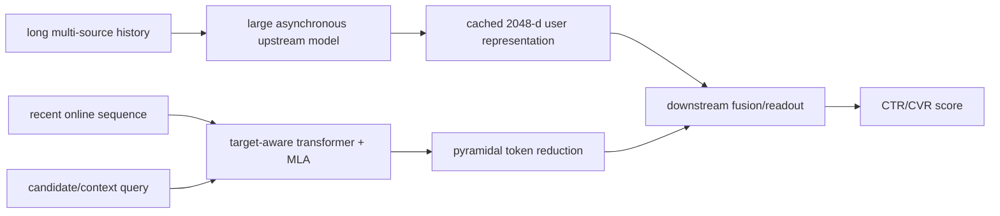

# LLaTTE: Multi-stage sequence scaling

> **Fidelity: 概念验证（非论文复现）**。当前实现省略 MLA、DHEN、semantic LLM features 和实际两阶段训练；旧指标只用于流水线诊断。

## 论文信息

| 项目 | 内容 |
| --- | --- |
| 论文链接 | [arXiv 2601.20083](https://arxiv.org/abs/2601.20083) |
| 公司/机构 | Meta |
| 首次公开日期 | 2026-01-27（arXiv v1） |
| 原文开源代码 | 否：论文未提供官方/作者代码（核查日期：2026-07-22） |
| Adapter | `llatte` |
| 本地复现代码 | [`src/auto_research/reproductions/llatte/`](https://github.com/daiwk/auto-research/tree/main/src/auto_research/reproductions/llatte/) |

## 原始论文总结

### 背景与主要改动

工业推荐序列模型同时受训练 FLOPs、在线延迟和跨阶段信息损失约束：直接把历史拉长会让在线 ranking 代价失控，只扩大下游模型又无法恢复上游丢掉的长期兴趣。LLaTTE 将 scaling 拆成两级：上游异步大序列模型读取超长、多源历史并缓存 2,048 维 user representation；下游在线模型读取约 400 个事件，并通过 target-aware query、multi-head latent attention（MLA）和 pyramidal token reduction 聚合候选相关信息。

### 核心公式

候选上下文 $c$ 注入 query，形成 target-aware attention：

$$
q_t=W_Q[x_t;c],\quad k_i=W_Kx_i,\quad
h_t=\sum_i\operatorname{softmax}_i(q_t^Tk_i/\sqrt d)W_Vx_i.
$$

论文的核心 scaling 观察用经验律描述：

$$
\Delta NE(C)\propto-\alpha\log_{10}C,
$$

跨阶段迁移效率定义为

$$
\tau=\frac{\Delta NE_{downstream}}{\Delta NE_{upstream}}.
$$

它用于判断上游序列算力提升能有多少转化为下游线上模型收益。

### 论文离线与线上效果

内部实验约 300 亿训练样本、128 张 H100、229K steps。论文发现平衡 depth/width 优于极深窄或极浅宽；增加序列计算的上游方案 NE 改善约 -0.14%，传到下游约 -0.07%，$\tau\approx50\%$；偏模型扩展方案约 -0.13%→-0.07%，$\tau\approx53\%$。这些是内部数据结果，无法在公开数据逐点核对。

多轮大规模 A/B 报告 Facebook Feed/Reels conversion **+4.3%**、旗舰广告排序模型 NE **-0.25%**，P99 ranking latency 无可测变化。

## 本地复现

> **本地对照口径**：基线是 Short Online Sequence；实验组是 LLaTTE two-stage proxy；NDCG@10 从 0.0420 降至 0.0405（**-3.57%**）。这是长历史缓存/融合模块消融；概念代理不能作为完整 LLaTTE 相对 DIN 的结果。

实现 target-aware 在线序列、pyramidal recent-token reduction、异步 upstream 全历史表示和 downstream 融合。MovieLens 评分 ≥4，per-user leave-two-out、full catalog、三个 seed；validation 只选融合权重。

| Architecture | Hit@10 | NDCG@10 |
|---|---:|---:|
| Short online sequence | **0.0851 ± 0.0040** | **0.0420 ± 0.0021** |
| LLaTTE two-stage proxy | 0.0823 ± 0.0036 | 0.0405 ± 0.0014 |

NDCG@10 **-3.57%**。短历史、小数据和弱内容特征下，cached long-history 表示没有带来收益，和论文“先有强语义表征再做 sequence scaling”的前提一致。原论文只使用 Meta 内部数据，因此保留 MovieLens proxy；NumPy scorer 不等价于 MLA/DHEN/H100 serving。诊断指标见 [`metrics/movielens-100k-seeds42-44.json`](metrics/movielens-100k-seeds42-44.json)。
