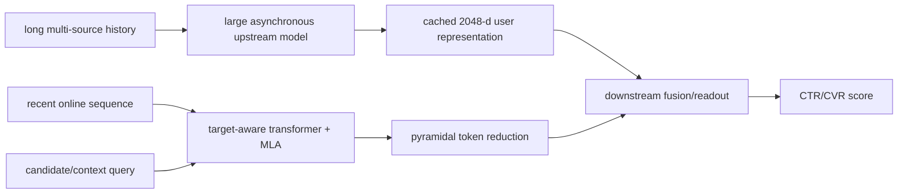
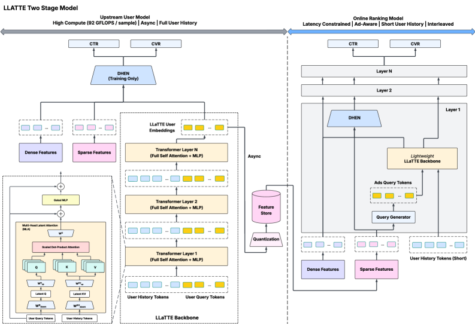

# LLaTTE: Multi-stage sequence scaling

> **Fidelity: 核心机制复现**。当前实现实际运行 BERT-tiny semantic features、MLA 上游 latent、target-aware 在线 attention 与 DHEN 门控；未复刻 Meta 私有广告特征和异步生产 serving。

## 论文信息

| 项目 | 内容 |
| --- | --- |
| 论文链接 | [arXiv 2601.20083](https://arxiv.org/abs/2601.20083) |
| 公司/机构 | Meta |
| 首次公开日期 | 2026-01-27（arXiv v1） |
| 原文开源代码 | 否：论文未提供官方/作者代码（核查日期：2026-07-28） |
| Adapter | `llatte` |
| 本地复现代码 | [`src/auto_research/reproductions/llatte/`](https://github.com/daiwk/auto-research/tree/main/src/auto_research/reproductions/llatte/) |

## 原始论文总结

### 背景与主要改动

工业推荐序列模型同时受训练 FLOPs、在线延迟和跨阶段信息损失约束：直接把历史拉长会让在线 ranking 代价失控，只扩大下游模型又无法恢复上游丢掉的长期兴趣。LLaTTE 将 scaling 拆成两级：上游异步大序列模型读取超长、多源历史并缓存 2,048 维 user representation；下游在线模型读取约 400 个事件，并通过 target-aware query、multi-head latent attention（MLA）和 pyramidal token reduction 聚合候选相关信息。

```mermaid
flowchart LR
  A["long multi-source history"] --> B["large asynchronous upstream model"]
  B --> C["cached 2048-d user representation"]
  D["recent online sequence"] --> E["target-aware transformer + MLA"]
  F["candidate/context query"] --> E
  E --> G["pyramidal token reduction"]
  C --> H["downstream fusion/readout"]
  G --> H
  H --> I["CTR/CVR score"]
```

<!-- paper-figure:start -->
### 原论文关键图

> **原论文 Figure 1（关键图）**：展示原论文提出的核心架构、主要模块及其连接关系。图片来自[原论文](https://arxiv.org/abs/2601.20083)，版权归原作者所有；点击图片可查看来源。
<!-- paper-figure:end -->

### 核心公式

候选上下文 $c$ 注入 query，形成 target-aware attention：

$$
q_t=W_Q[x_t;c],\quad k_i=W_Kx_i,\quad
h_t=\sum_i\operatorname{softmax}_i(q_t^Tk_i/\sqrt d)W_Vx_i.
$$

论文的核心 scaling 观察用经验律描述：

$$
\Delta NE(C)\propto-\alpha\log_{10}C,
$$

跨阶段迁移效率定义为

$$
\tau=\frac{\Delta NE_{downstream}}{\Delta NE_{upstream}}.
$$

它用于判断上游序列算力提升能有多少转化为下游线上模型收益。

### 论文离线与线上效果

内部实验约 300 亿训练样本、128 张 H100、229K steps。论文发现平衡 depth/width 优于极深窄或极浅宽；增加序列计算的上游方案 NE 改善约 -0.14%，传到下游约 -0.07%，$\tau\approx50\%$；偏模型扩展方案约 -0.13%→-0.07%，$\tau\approx53\%$。这些是内部数据结果，无法在公开数据逐点核对。

多轮大规模 A/B 报告 Facebook Feed/Reels conversion **+4.3%**、旗舰广告排序模型 NE **-0.25%**，P99 ranking latency 无可测变化。

## 本地复现

> **本地对照口径**：基线是相同 ID/语义 embedding 的 short online sequence；实验组增加 MLA upstream、候选感知 online attention 与 DHEN，NDCG@10 **+49.81%**。训练预算一致，不是相对 DIN。

MovieLens 标题先经公开 `prajjwal1/bert-tiny` 编码并缓存；ID 与语义 token 共同进入序列模型。4 个 latent query 压缩完整历史，候选 query 读取 recent 12，再由 DHEN 学习三个 expert 的门控。评分 ≥4、per-user leave-two-out、full catalog、三个 seed。

| Architecture | Hit@10 | NDCG@10 |
|---|---:|---:|
| Short online sequence | 0.0079 ± 0.0013 | 0.0039 ± 0.0005 |
| LLaTTE MLA + DHEN | **0.0118 ± 0.0009** | **0.0058 ± 0.0003** |

NDCG@10 **+49.81%**，但 head share 也从 8.55% 升至 15.85%，部分收益伴随更热门的推荐。该公开小模型结果验证多阶段模块在本地口径下优于 matched short baseline，不等同于 Meta 线上 conversion。稳定指标见 [`metrics/movielens-100k-seeds42-44.json`](metrics/movielens-100k-seeds42-44.json)。
