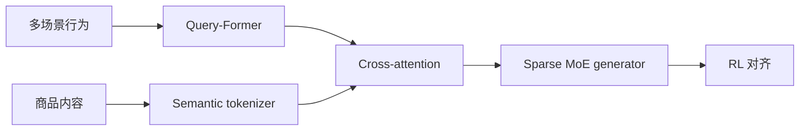

# OneMall：统一多场景端到端生成推荐

> **Fidelity: 核心机制复现**。执行场景 prompt、三层 Semantic ID 和跨行为融合；缩小数据与模型规模。

## 论文信息

| 项目 | 内容 |
| --- | --- |
| 论文链接 | [arXiv 2601.21770](https://arxiv.org/abs/2601.21770) |
| 公司/机构 | Kuaishou |
| 首次公开日期 | 2026-01-29（arXiv v1） |
| 原文开源代码 | 否：论文未提供官方/作者代码（核查日期：2026-07-27） |
| Adapter | `onemall` |
| 本地复现代码 | [`src/auto_research/reproductions/onemall/`](https://github.com/daiwk/auto-research/tree/main/src/auto_research/reproductions/onemall/) |

## 原始论文总结

### 背景与主要改动

快手电商的商品卡、短视频和直播分发原本由不同链路维护。OneMall 用统一商品 Semantic ID、Query-Former 压缩、多行为 cross-attention、Sparse MoE 生成器及 RL 对齐，把多个场景收进一个生成推荐家族。



### 核心公式

场景 $s$ 下生成商品 code 序列 $c_{1:L}$：

$$
\mathcal L_{\mathrm{gen}}=-\sum_{\ell=1}^{L}\log p(c_\ell\mid c_{<\ell},h,s),
\qquad
\mathcal J=\mathbb E_{\pi_\theta}[R_{\mathrm{rank}}].
$$

### 论文离线与线上效果

线上商品卡 GMV `+13.01%`、短视频订单 `+15.32%`、直播订单 `+2.78%`。这些是论文生产系统结果，不是本地数值。

## 本地复现

> **本地对照口径**：基线是共享 transition/content ensemble；实验组只增加场景 prompt、三层 residual SID 和跨行为融合，MovieLens-100K NDCG@10 `0.03540→0.03693`，相对 **+4.33%**，Hit@10 相对 `-4.35%`。

validation 只选择融合权重，test 未参与调参。结果见 [`metrics/movielens-seed42.json`](metrics/movielens-seed42.json)。

```bash
auto-research reproduce --paper onemall --dataset-dir data --seed 42
```

## 复现边界

MovieLens genre 仅代理场景；未复刻快手私有商品特征、Sparse MoE、生产 RL 和线上 serving。
