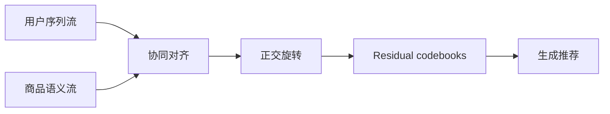

# DOS：双流正交 Semantic ID

> **Fidelity: 核心机制复现**。执行协同/语义双流、正交旋转及 residual quantization。

## 论文信息

| 项目 | 内容 |
| --- | --- |
| 论文链接 | [arXiv 2602.04460](https://arxiv.org/abs/2602.04460) |
| 公司/机构 | Meituan |
| 首次公开日期 | 2026-02-04（arXiv v1） |
| 原文开源代码 | 否：论文未提供官方/作者代码（核查日期：2026-07-28） |
| Adapter | `dos` |
| 本地复现代码 | [`src/auto_research/reproductions/dos/`](https://github.com/daiwk/auto-research/tree/main/src/auto_research/reproductions/dos/) |

## 原始论文总结

### 背景与主要改动

普通 Semantic ID 的内容 codebook 与生成任务存在间隙。DOS 以用户行为流和商品语义流共同对齐 codebook，并用可约束的正交旋转把主语义与次语义解耦后逐层量化。



### 核心公式

$$
X_{\mathrm{orth}}=XW,\qquad
\mathcal L_{\mathrm{orth}}=\lVert W^\top W-I\rVert_F^2,\qquad
r_{\ell+1}=r_\ell-e_{c_\ell}.
$$

### 论文离线与线上效果

论文在美团 30% 流量运行一周，收入 `+1.15%`，并已部署至数亿用户。

## 本地复现

> **本地对照口径**：基线是未旋转的 content/collaborative ensemble；实验组执行 Procrustes 正交对齐与三层 ORQ，NDCG@10 `0.03540→0.03938`，相对 **+11.26%**。

旋转正交误差为 `6.67e-15`。结果见 [`metrics/movielens-seed42.json`](metrics/movielens-seed42.json)。

```bash
auto-research reproduce --paper dos --dataset-dir data --seed 42
```

## 复现边界

公开 genre/共现替代美团 LLM item embedding 和生产生成器，不能与论文收入增益直接比较。
