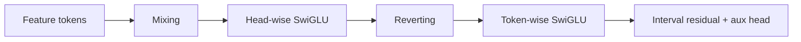
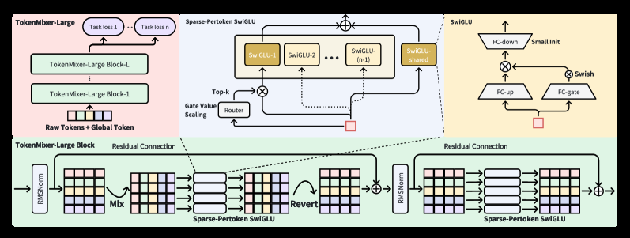

# TokenMixer-Large：工业精排 Token Mixing 扩展

> **复现保真度：完整核心链路复现。** 主干、interval residual、中层辅助损失均真实训练，仅缩小规模。

## 论文信息

| 项目 | 内容 |
| --- | --- |
| 论文链接 | [arXiv 2602.06563](https://arxiv.org/abs/2602.06563) |
| 公司/机构 | ByteDance |
| 首次公开日期 | 2026-02-06（arXiv v1） |
| 原文开源代码 | 否：论文未提供官方/作者代码（核查日期：2026-08-09） |
| Adapter | `tokenmixer-large` |
| 本地复现代码 | [`src/auto_research/reproductions/tokenmixer_large/`](https://github.com/daiwk/auto-research/tree/main/src/auto_research/reproductions/tokenmixer_large/) |

## 原始论文总结

### 背景与主要改动

TokenMixer-Large 将候选与多域特征 token 先无参数 mixing，再分别做 head-wise SwiGLU，revert 后执行 token-wise SwiGLU；深层网络加入间隔残差和中间监督，使推荐精排能够稳定扩容。



<!-- paper-figure:start -->
### 原论文关键图

[](https://ar5iv.labs.arxiv.org/html/2602.06563/assets/x1.png)

> **原论文 Figure 1（关键图）**：展示原论文提出的核心架构、主要模块及其连接关系。图片来自[原论文](https://arxiv.org/abs/2602.06563)，版权归原作者所有；点击图片可查看来源。
<!-- paper-figure:end -->

### 核心公式

$$
X'=\operatorname{Revert}(\operatorname{SwiGLU}_{head}(\operatorname{Mix}(X))),
\qquad X_{\ell+1}=X_\ell+\operatorname{SwiGLU}_{token}(X').
$$

### 论文离线与线上效果

电商订单 +1.66%、人均预览支付 GMV +2.98%，广告 ADSS +2.0%，直播收入 +1.4%。

## 本地复现

MovieLens 100K 上 TokenMixer-Large 与 `rankmixer_dense` 使用相同维度、层数、负采样和训练步数。

> **本地对照口径**：基线为同协议 RankMixer dense，实验组为 TokenMixer-Large；NDCG@10 0.00385→0.00414，相对 +7.54%，见 `metrics/movielens-100k-seed42.json`。

```bash
auto-research reproduce --paper tokenmixer-large --dataset-dir data --seed 42
```
