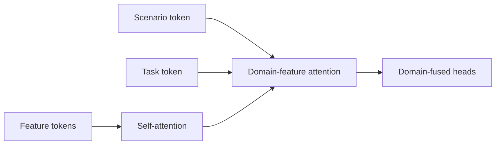
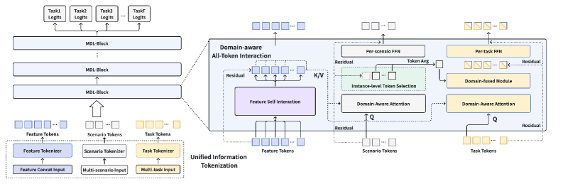

# MDL：以 tokenization 统一多分布学习

> **Fidelity: 核心机制复现**。执行 feature/scenario/task tokens 与 domain-feature attention。

## 论文信息

| 项目 | 内容 |
| --- | --- |
| 论文链接 | [arXiv 2602.07520](https://arxiv.org/abs/2602.07520) |
| 公司/机构 | ByteDance / Douyin |
| 首次公开日期 | 2026-02-07（arXiv v1） |
| 原文开源代码 | 否：论文未提供官方/作者代码（核查日期：2026-08-09） |
| Adapter | `mdl` |
| 本地复现代码 | [`src/auto_research/reproductions/mdl/`](https://github.com/daiwk/auto-research/tree/main/src/auto_research/reproductions/mdl/) |

## 原始论文总结

### 背景与主要改动

工业多场景、多任务模型常只在浅层做 gate，未充分共享大模型参数。MDL 把 feature、scenario 和 task 都表示成 token，经 feature self-attention、domain-feature attention 和 domain-fused aggregation 深层交互。



<!-- paper-figure:start -->
### 原论文关键图

[](https://ar5iv.labs.arxiv.org/html/2602.07520/assets/x1.png)

> **原论文 Figure 1（关键图）**：展示原论文提出的核心架构、主要模块及其连接关系。图片来自[原论文](https://arxiv.org/abs/2602.07520)，版权归原作者所有；点击图片可查看来源。
<!-- paper-figure:end -->

### 核心公式

$$
A_{d,f}=\operatorname{softmax}\left(\frac{Q_dK_f^\top}{\sqrt d}\right),
\qquad
h_{d,t}=\operatorname{Agg}(A_{d,f}V_f,e_d,e_t).
$$

### 论文离线与线上效果

抖音线上 LT30 `+0.0626%`，query rewrite rate `-0.3267%`，覆盖数亿用户。

## 本地复现

> **本地对照口径**：基线是共享但非 tokenized ranker；实验组加入 19 feature tokens、19 scenario tokens 和 2 task tokens，NDCG@10 `0.03540→0.04012`，相对 **+13.34%**，但 head share `+73.43%`。

准确率提升伴随明显头部偏置，不能只报主指标。见 [`metrics/movielens-seed42.json`](metrics/movielens-seed42.json)。

```bash
auto-research reproduce --paper mdl --dataset-dir data --seed 42
```

## 复现边界

MovieLens genre/next-item 代理抖音场景与任务，未复刻生产参数规模、私有标签和 serving。
