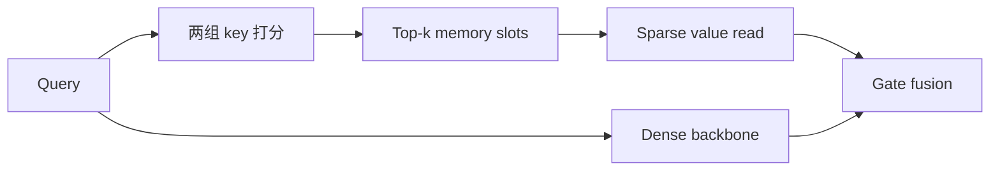

# MSN：工业搜索排序的稀疏记忆网络

> **复现保真度：核心机制复现。** Product-Key Memory、top-k 稀疏读取和门控主干均实际执行。

## 论文信息

| 项目 | 内容 |
| --- | --- |
| 论文链接 | [arXiv 2602.07526](https://arxiv.org/abs/2602.07526) |
| 公司/机构 | ByteDance / Douyin Search |
| 首次公开日期 | 2026-02-07（arXiv v1） |
| 原文开源代码 | 否：论文未提供官方/作者代码（核查日期：2026-07-28） |
| Adapter | `msn` |
| 本地复现代码 | [`src/auto_research/reproductions/msn/`](https://github.com/daiwk/auto-research/tree/main/src/auto_research/reproductions/msn/) |

## 原始论文总结

### 背景与主要改动

工业排序希望扩大参数量但不同比例增加计算。MSN 将大容量知识放入两轴 Product-Key Memory，根据 query 只激活少量槽位，再用 gate 与 dense backbone 融合。



### 核心公式

$$
(i,j)\in\operatorname{TopK}(q^\top k_i^{(1)}+q^\top k_j^{(2)}),\quad
h'=g(q)m_{ij}+(1-g(q))h.
$$

### 论文离线与线上效果

抖音搜索线上 active days +0.0503%、watch time +0.2958%、finish rate +0.2071%。

## 本地复现

公开 genre 构造两轴 key，交互转移写入 memory value，每次只读取四个槽位。

> **本地对照口径**：基线为 dense transition/content ranker，实验组为 gated top-k PKM；NDCG@10 0.03540→0.04240，相对 +19.78%，见 `metrics/movielens-100k-seed42.json`。

```bash
auto-research reproduce --paper msn --dataset-dir data --seed 42
```
