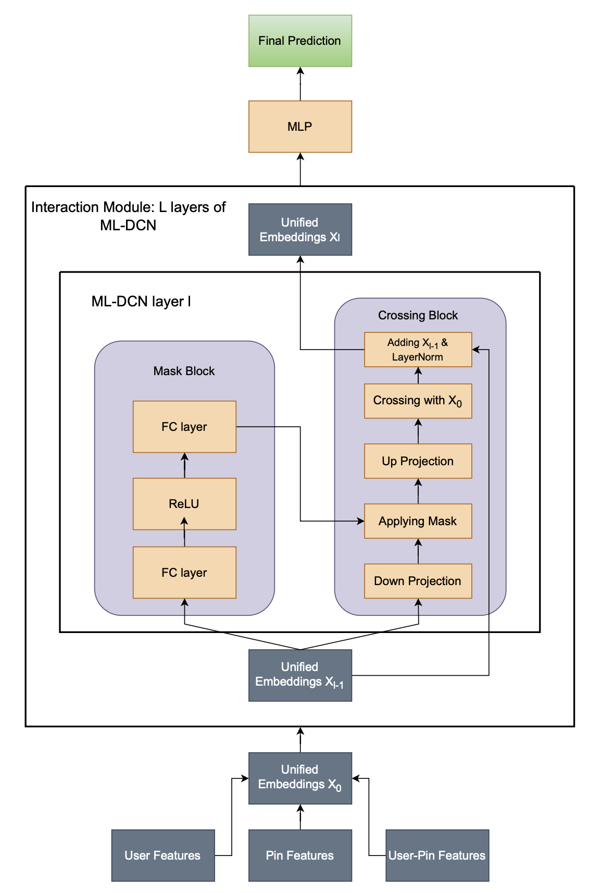

# ML-DCN: Masked Low-Rank Deep Crossing Network Towards Scalable Ads Click-through Rate Prediction at Pinterest

> **保真度：核心机制复现**。原文线上结论、本地公开数据实验和未复刻部分分开陈述。

## 论文信息

| 项目 | 内容 |
| --- | --- |
| 论文链接 | [arXiv 2602.09194](https://arxiv.org/abs/2602.09194) |
| 公司/机构 | Pinterest |
| 首次公开日期 | 2026-02-09（arXiv v1） |
| 原文开源代码 | 否：原文未提供官方/作者代码（核查日期：2026-08-24） |
| Adapter | `ml-dcn` |
| 本地复现代码 | [`src/auto_research/reproductions/ml_dcn/`](https://github.com/daiwk/auto-research/tree/main/src/auto_research/reproductions/ml_dcn/) |

## 原始论文总结

### 背景与主要改动

把 DCNv2 的全维交叉替换为可调内部维度的低秩交叉，并以可学习 mask 选择交叉通道，在相同 FLOPs 下扩大容量。


<!-- paper-figure:start -->
### 原论文关键图

[](https://arxiv.org/html/2602.09194v1/figures/mldcn.png)

> **原论文 Figure 1（关键图）**：展示原论文提出的核心架构、主要模块及其连接关系。图片来自[原论文](https://arxiv.org/abs/2602.09194)，版权归原作者所有；点击图片可查看来源。
<!-- paper-figure:end -->

### 核心公式

$$
x_{l+1}=x_l+x_0\odot[U_l(V_l(x_l\odot m_l))]+b_l
$$

### 论文离线与线上效果

原文线上证据：**platform-wide CTR +1.89%**（production A/B at neutral cost，Section 4.2 / Table 6）。论文私有口径不能与下方 MovieLens 指标直接比较。

## 本地复现

> **本地对照口径**：基线为共享 transition + content scorer；实验组在同一用户、物品、全库候选和 seed 上只加入 `ml-dcn` 核心机制，相对 NDCG@10 -2.08%。

MovieLens-100K、220 users / 360 items、seed 42：NDCG@10 0.0540 → **0.0529（-2.08%）**，Hit@10 0.1091 → 0.1091。验证集只选择混合权重，测试集未参与调参。

```bash
auto-research reproduce --paper ml-dcn --dataset-dir data --seed 42
```

固定指标见 [`metrics/public-seed42.json`](metrics/public-seed42.json)。

## 复现边界

在 MovieLens-100K 固定全库候选、相同切分和 seed 上执行论文核心机制；私有特征、生产基础模型和在线流量不可公开，论文 A/B 数字只作原文引用。 本地实现拥有独立模型状态和打分路径；负结果同样保留，且本地相对变化不得与原文 A/B 提升混写。
