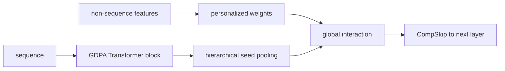
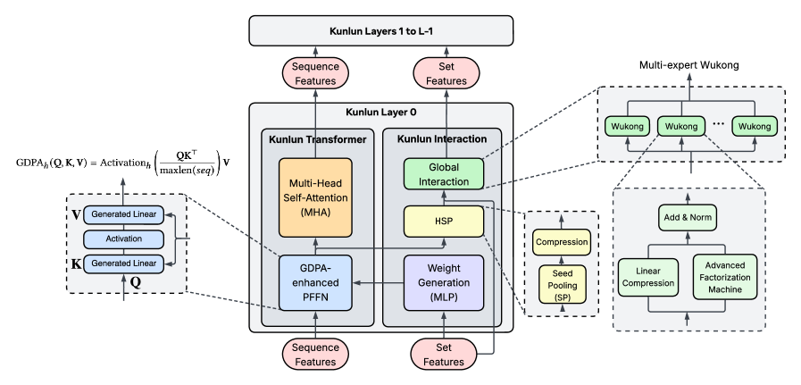

# Kunlun：面向超大规模推荐的统一深层架构

> **Fidelity: 核心机制复现**。本地执行 GDPA、分层 seed pooling、expert routing 和 CompSkip；不声称复刻 Meta Ads 模型规模。

## 论文信息

| 项目 | 内容 |
| --- | --- |
| 论文链接 | [arXiv 2602.10016](https://arxiv.org/abs/2602.10016) |
| 公司/机构 | Meta |
| 首次公开日期 | 2026-02-10（arXiv v1） |
| 原文开源代码 | 否：论文未提供官方/作者代码（核查日期：2026-08-09） |
| Adapter | `kunlun` |
| 本地复现代码 | [`src/auto_research/reproductions/kunlun/`](https://github.com/daiwk/auto-research/tree/main/src/auto_research/reproductions/kunlun/) |

## 原始论文总结

### 背景与主要改动

传统广告模型把序列塔、稠密交叉和系统并行分别优化，扩大规模后收益快速饱和。Kunlun 在每层同时放置 Transformer Block 与 Interaction Block：GDPA/PFFN 建模序列，HSP 汇总序列 seed，Global Interaction 交换序列与非序列信息；CompSkip 和 expert parallel 保持深层训练稳定与吞吐。



<!-- paper-figure:start -->
### 原论文关键图

[](https://arxiv.org/html/2602.10016v3#S1.F1)

> 原论文 Figure 1：Kunlun Transformer Block 与 Interaction Block 的逐层组合。图片来自[原论文](https://arxiv.org/abs/2602.10016)，版权归原作者所有。
<!-- paper-figure:end -->

### 核心公式

GDPA 将内容 attention 与可学习 gate 相乘，CompSkip 再控制深层残差：

$$
A=\operatorname{softmax}(QK^\top/\sqrt d+\log\sigma(G)),\qquad h_{l+1}=\alpha h_l+(1-\alpha)F_l(h_l).
$$

### 论文离线与线上效果

- 已部署到 Meta Ads 主要模型，topline `+1.2%`。
- MFU 从 `17%` 提升到 `37%`，整体 scaling efficiency 约 `2×`。

## 本地复现

> **本地对照口径**：基线为 shallow transition-content ranker，实验组执行 Kunlun compact core；NDCG@10 相对 `-5.25%`。

四层 compact core 对相同基线的 Hit@10 `+4.17%`、NDCG@10 `-5.25%`、fresh Hit@10 `+50%`、head share `-6.12%`。多样性代理改善但排序质量不稳定。

指标见 [`metrics/movielens-100k-seed42.json`](metrics/movielens-100k-seed42.json)。

```bash
auto-research reproduce --paper kunlun --dataset-dir data --seed 42
```

## 复现边界

本地仅验证网络算子和信息流；没有 Meta Ads 私有数据、万亿参数、expert parallel 或硬件 MFU 对照。
