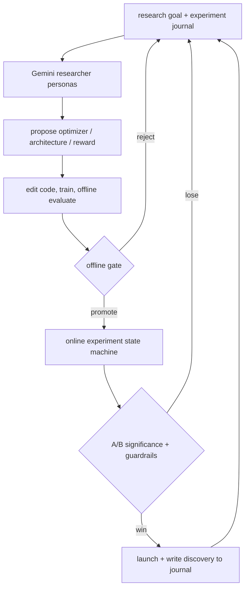

# Self-Evolving Recommendation System

- 论文：[arXiv 2602.10226](https://arxiv.org/abs/2602.10226)，Google/YouTube
- Adapter：`self-evolving-rec`；代码：`src/auto_research/reproductions/self_evolving_rec/`
- 本地数据：MovieLens-100K；运行：`auto-research reproduce --paper self-evolving-rec --seed 42`

## 原始论文总结

### 背景与主要改动

推荐研发通常依赖人工提出假设、改代码、跑离线实验、申请线上 A/B，再把经验散落在文档里。论文将 Gemini 2.5 放入双层闭环：内层 agent 以 researcher personas、实验 journal、代码/训练工具探索 optimizer、网络结构和 reward；外层状态机负责安全检查、资源约束和真实 A/B promotion，再把线上结论写回记忆，驱动下一轮搜索。

### 核心公式

论文可抽象为受预算约束的双层优化：

$$\theta^*(\Phi)=\arg\min_\theta\mathcal L_{proxy}(D;\theta,\Phi),$$
$$\Phi^*=\arg\max_\Phi\mathbb E[M_{online}(\theta^*(\Phi))]\quad
\text{s.t. }G(\Phi)\le C,$$

其中 $\Phi$ 是 agent 生成的优化器/结构/reward 方案，$G$ 表示训练、serving 和安全约束。关键贡献不是某一个新网络，而是让离线 proxy、线上反馈和长期记忆形成闭环。

### 论文离线与在线效果

LLM ablation 中每种配置执行 6 个独立 run、探索约 70 个 ideas；更强模型、persona 分工和完整上下文提升有效方案产出率。生产发现的线上结果如下（`*` 表示 95% 显著）：

| Discovery | YouTube metric | 另一 surface metric |
|---|---:|---:|
| RMSProp | +0.06%* | +0.12%* |
| 4× training efficiency | -0.01% | +0.06% |
| 2× training efficiency | +0.01% | +0.09%* |
| GLU | +0.06%* | +0.14%* |
| activation change | -0.02% | +0.12%* |
| multi-objective reward | +0.03%* | +0.13%* |

论文的离线 funnel 使用 Google 内部数据，没有公开可下载的同源数据集。

## 本地复现

实现 experiment journal、离线候选 funnel、validation promotion、test-only outer-loop proxy，以及论文披露的 Adagrad→RMSProp、GLU、recency-aware multi-objective reward。三个 seed；候选生成器固定，保证离线可重复，不调用 Gemini。

| Workflow | Hit@10 | NDCG@10 |
|---|---:|---:|
| Human baseline | 0.0833 ± 0.0043 | 0.0399 ± 0.0018 |
| Promoted candidate | **0.0894 ± 0.0075** | **0.0427 ± 0.0038** |

平均 NDCG@10 **+7.13%**。三个 seed 分别晋级完整组合、RMSProp 和原始 baseline，说明 funnel 也能拒绝退化方案。MovieLens test holdout 不是线上 A/B，固定候选空间也不等价于 agent 自动研究能力。
