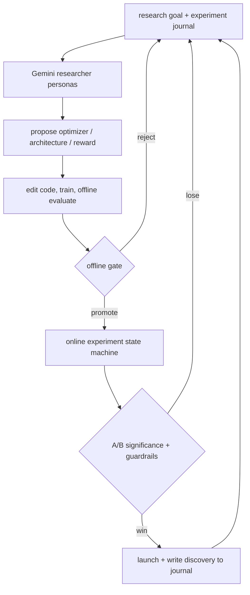

# Self-Evolving Recommendation System

> **Fidelity: 核心机制复现**。本地 `SmolLM2-135M-Instruct` 实际读取 journal、给可执行配置打分、逐轮提出未尝试方案并接收 validation 反馈；未复刻 Google 生产 A/B 基础设施。

## 论文信息

| 项目 | 内容 |
| --- | --- |
| 论文链接 | [arXiv 2602.10226](https://arxiv.org/abs/2602.10226) |
| 公司/机构 | Google / YouTube |
| 首次公开日期 | 2026-02-10（arXiv v1） |
| 原文开源代码 | 否：论文未提供官方/作者代码（核查日期：2026-07-28） |
| Adapter | `self-evolving-rec` |
| 本地复现代码 | [`src/auto_research/reproductions/self_evolving_rec/`](https://github.com/daiwk/auto-research/tree/main/src/auto_research/reproductions/self_evolving_rec/) |

## 原始论文总结

### 背景与主要改动

推荐研发通常依赖人工提出假设、改代码、跑离线实验、申请线上 A/B，再把经验散落在文档里。论文将 Gemini 2.5 放入双层闭环：内层 agent 以 researcher personas、实验 journal、代码/训练工具探索 optimizer、网络结构和 reward；外层状态机负责安全检查、资源约束和真实 A/B promotion，再把线上结论写回记忆，驱动下一轮搜索。

```mermaid
flowchart TD
  A["research goal + experiment journal"] --> B["Gemini researcher personas"]
  B --> C["propose optimizer / architecture / reward"]
  C --> D["edit code, train, offline evaluate"]
  D --> E{"offline gate"}
  E -->|reject| A
  E -->|promote| F["online experiment state machine"]
  F --> G{"A/B significance + guardrails"}
  G -->|win| H["launch + write discovery to journal"]
  G -->|lose| A
  H --> A
```

### 核心公式

论文可抽象为受预算约束的双层优化：

$$
\theta^*(\Phi)=\arg\min_\theta\mathcal L_{proxy}(D;\theta,\Phi),
$$
$$
\Phi^*=\arg\max_\Phi\mathbb E[M_{online}(\theta^*(\Phi))]\quad
\text{s.t. }G(\Phi)\le C,
$$

其中 $\Phi$ 是 agent 生成的优化器/结构/reward 方案，$G$ 表示训练、serving 和安全约束。关键贡献不是某一个新网络，而是让离线 proxy、线上反馈和长期记忆形成闭环。

### 论文离线与线上效果

LLM ablation 中每种配置执行 6 个独立 run、探索约 70 个 ideas；更强模型、persona 分工和完整上下文提升有效方案产出率。生产发现的线上结果如下（`*` 表示 95% 显著）：

| Discovery | YouTube metric | 另一 surface metric |
|---|---:|---:|
| RMSProp | +0.06%* | +0.12%* |
| 4× training efficiency | -0.01% | +0.06% |
| 2× training efficiency | +0.01% | +0.09%* |
| GLU | +0.06%* | +0.14%* |
| activation change | -0.02% | +0.12%* |
| multi-objective reward | +0.03%* | +0.13%* |

论文的离线 funnel 使用 Google 内部数据，没有公开可下载的同源数据集。

## 本地复现

> **本地对照口径**：基线是 Human/Adagrad 配置；实验组是本地 LLM agent 经过四代 journal→提案→训练→validation 反馈后晋级的配置，NDCG@10 **+2.57%**。test 只在晋级完成后运行，不是单一模型相对 DIN。

实现 experiment journal、约束式可执行搜索空间、validation promotion 与隔离 test。每代由本地指令 LLM 根据此前指标为未尝试配置计算条件 log-loss 并提案；搜索维度包含 Adagrad/RMSProp、GLU gate、multi-objective reward 和学习率。三个 seed，不调用闭源 Gemini。

| Workflow | Hit@10 | NDCG@10 |
|---|---:|---:|
| Human baseline | 0.0833 ± 0.0043 | 0.0399 ± 0.0018 |
| LLM-agent promoted | **0.0844 ± 0.0054** | **0.0409 ± 0.0028** |

平均 NDCG@10 **+2.57%**。seed 42 晋级 multi-objective reward，seed 43/44 均保留人工 baseline，说明闭环能够拒绝 validation 退化方案；提升小于 seed 波动，不能声称稳定收益。MovieLens test holdout 不是线上 A/B，约束式搜索也不等于 Google 的生产代码编辑环境。稳定指标见 [`metrics/movielens-100k-seeds42-44.json`](metrics/movielens-100k-seeds42-44.json)。
