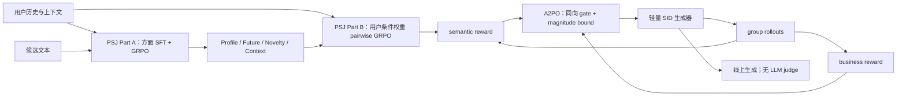

# S-GRec：Personalized Semantic-Aware Generative Recommendation with Asymmetric Advantage

> **Fidelity: 完整核心链路**。本地实际执行 causal LLM LoRA judge、方面打分 SFT+GRPO、用户条件权重 pairwise GRPO、SID 自回归生成器、5% 稀疏 semantic sampling，以及从相同 SFT checkpoint 初始化的 Reward-Sum、Adv-Sum、A2PO。模型规模与数据规模缩小，腾讯私有人工广告标注和 eCPM 模型由公开 Office 行为与 Qwen embedding 构造的监督替代。

## 论文信息

| 项目 | 内容 |
| --- | --- |
| 论文链接 | [arXiv 2602.10606](https://arxiv.org/abs/2602.10606) |
| 公司/机构 | Tencent / WeChat Channels |
| 首次公开日期 | 2026-02-11（arXiv v1） |
| 原文开源代码 | 否：论文未提供官方/作者代码（核查日期：2026-07-15） |
| Adapter | `s-grec` |
| 本地复现代码 | [`src/auto_research/reproductions/s_grec/`](https://github.com/daiwk/auto-research/tree/main/src/auto_research/reproductions/s_grec/) |

## 原始论文总结

### 背景与主要改动

生成式推荐通常只从行为日志学习 next-item likelihood，难以理解用户为何偏好某个内容；直接把 LLM 放到在线链路又无法满足工业延迟。S-GRec 将 LLM 仅作为离线语义 judge：两阶段 Personalized Semantic Judge（PSJ）先输出可解释的方面证据，再学习每个用户的方面权重；轻量生成器线上只生成 Semantic ID，不依赖 LLM。

论文的第二个问题是语义目标可能与收入目标冲突。A2PO 不直接相加异量纲 reward，而是在 rollout group 内分别标准化 business 与 semantic advantage，以 business 为锚；只有两个 advantage 同向时才加入语义项，并把有效语义贡献限制在 business advantage 的幅度以内。线上只对 5% 样本调用 PSJ。



### 核心公式

PSJ 输出方面向量 $\mathbf{s}(x,a)$，用户条件 aggregator 输出非负且归一化的权重 $\mathbf{w}(x)$：

$$
s_{\mathrm{hol}}(x,a)=\mathbf{w}(x)^\top\mathbf{s}(x,a).
$$

对偏好对 $a_i\succ a_j$，采样一组离散权重向量，并以排序一致性作为 pairwise reward：

$$
r_{\mathrm{pw}}^{(g)}=\mathbb{I}\left[s_{\mathrm{hol}}^{(g)}(x,a_i)>s_{\mathrm{hol}}^{(g)}(x,a_j)\right].
$$

A2PO 的融合 advantage 与自适应系数为：

$$
A^{(i)}=A_{\mathrm{biz}}^{(i)}+\lambda^{(i)}A_{\mathrm{sem}}^{(i)},
$$

$$
\lambda^{(i)}=\mathbb{I}[\operatorname{sign}(A_{\mathrm{biz}}^{(i)})=\operatorname{sign}(A_{\mathrm{sem}}^{(i)})]
\frac{\min(|A_{\mathrm{biz}}^{(i)}|,|A_{\mathrm{sem}}^{(i)}|)}
{\max(|A_{\mathrm{biz}}^{(i)}|,|A_{\mathrm{sem}}^{(i)}|)+\epsilon}.
$$

因此 $|\lambda A_{\mathrm{sem}}|\le |A_{\mathrm{biz}}|$。最终把 $A$ 代入 clipped group policy objective。

### 论文离线与线上效果

- Office：MiniOneRec HR@10 0.1634、NDCG@10 0.1242；S-GRec 为 0.1689、0.1308，相对约 +3.4%、+5.3%。
- Industrial：MiniOneRec HR@10 0.1586、NDCG@10 0.1167；S-GRec 为 0.1632、0.1202，相对约 +2.9%、+3.0%。
- PSJ Part A：Qwen3-4B SFT+GRPO 的 PairAUC 0.8116、PointAcc 0.8687。
- Reward-Sum 在 Office HR@10 降至 0.0904；论文用它说明原始 reward 直接相加会失稳。
- 5% semantic sampling 达到 Office 全量调用表现的 99.1%，推理成本约降低 20 倍。
- WeChat Channels 20% 广告流量：GMV +1.19%、GMV-Normal +1.55%、CTR +1.16%、dislike -2.02%。

## 本地复现

> **本地对照口径**：基线是相同公开 Office 数据、相同 SID Transformer 和 600-step 训练预算的 MiniOneRec-style `business` SFT checkpoint；实验组 `a2po` 从完全相同 checkpoint 初始化并执行 240 次策略更新，test HR@10 相对 **0.00%**，NDCG@10 相对 **-4.53%**。A2PO 按预声明的 validation HR@10 优先规则晋级；这不是相对 DIN，也不是论文线上 A/B。

本地使用完整 3,459 商品目录，并过滤用户历史物品；不是 sampled-candidate 指标。训练数据为 12,000 条 Office 序列，validation/test 各固定抽取 96 个用户。公开数据没有时间和位置，因此按论文 Amazon 设置删除 Context，只训练 Profile、Future、Novelty 三个离散方面。

| Variant | Validation HR@10 | Validation NDCG@10 | Test HR@10 | Test NDCG@10 |
|---|---:|---:|---:|---:|
| MiniOneRec-style SFT | 0.09375 | 0.07949 | 0.04167 | 0.03013 |
| Reward-Sum | 0.10417 | 0.07450 | 0.04167 | 0.02877 |
| Adv-Sum | 0.10417 | 0.07450 | 0.04167 | 0.02877 |
| A2PO | 0.10417 | 0.07450 | 0.04167 | 0.02877 |

PSJ SFT loss 从 1.3690 降到 1.1725；point accuracy 从 0.3490 提升到 GRPO 后的 0.3802，pairwise accuracy 为 0.5938。A2PO 在 240 次更新中实际调用 PSJ 9 次（随机实现的 5%），语义/business advantage 同向率 42.36%，平均有效系数 0.1426，幅度约束越界 0 次。三个策略消融使用完全相同的 rollout、负例和 semantic-query mask。

多轮迭代先修正了 embedding 标签塌缩，再把 MiniOneRec 基线固定为 SFT checkpoint，关闭生成器 dropout，最后统一所有消融的 rollout 随机种子。最终 clipping fraction 为 0；A2PO 在 validation HR@10 上晋级，但未改善 held-out 指标，因此不宣称效果复现成功。

```bash
auto-research reproduce --paper s-grec --seed 42
```

稳定指标见 [`metrics/office-seed42.json`](metrics/office-seed42.json)。模型、checkpoint、公开数据和原始 `runs/` 均不提交 Git。

## 复现边界

- Qwen3-4B PSJ 缩小为 SmolLM2-135M；Qwen2.5-1.5B MiniOneRec 缩小为 0.41M 参数 SID Transformer，但 judge、两阶段训练、生成和策略路径均实际执行。
- DeepSeek-R1 初标、20k 人工 point-wise 与 40k pairwise 私有广告标注不可获得；本地用真实 next-item 对比和 Qwen item embedding 构造三方面离散监督。这是最大的数据保真度差异。
- 公共数据没有货币信号，business reward 使用论文明确允许的 ground-truth next-item ranking proxy；不把它称为 eCPM。
- 本地未复刻 GRPO Sample Server、周期发布和 WeChat 广告库存，但 serving 模型本身不调用 PSJ，保留论文离线 judge / 在线轻模型的边界。
