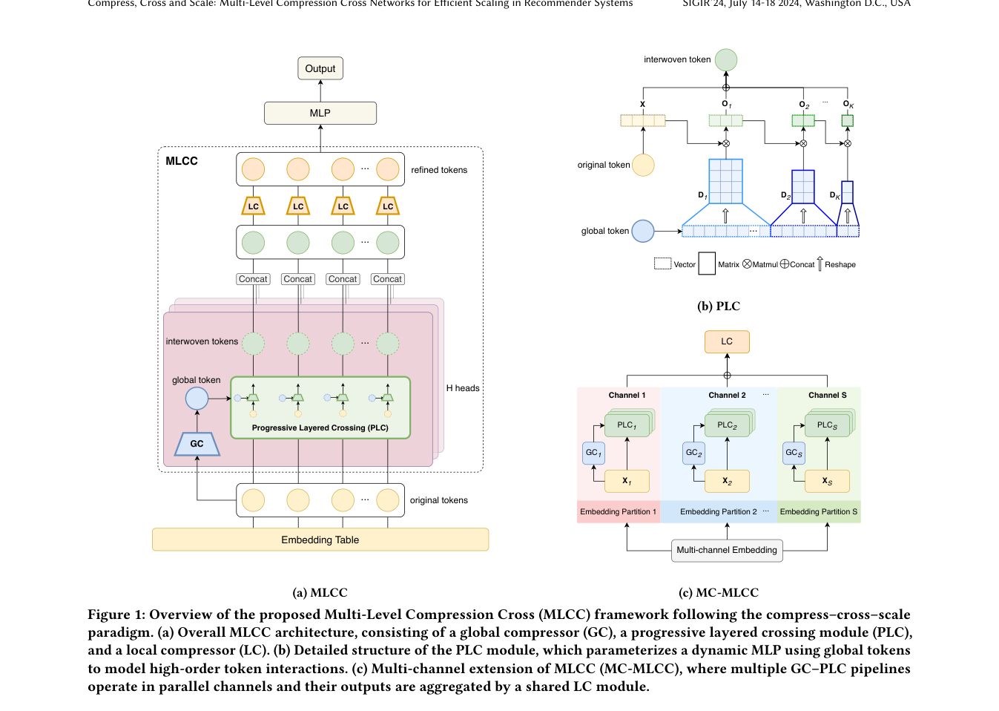

# MLCC：多层压缩交叉网络

> **Fidelity: 核心机制复现**。本地代码执行论文最有辨识度、可由公开数据验证的机制；私有数据、生产模型与服务栈明确列为边界。

## 论文信息

| 项目 | 内容 |
| --- | --- |
| 论文链接 | [arXiv 2602.12041](https://arxiv.org/abs/2602.12041) |
| 公司/机构 | Bilibili（按第一作者所属机构聚合） |
| 首次公开日期 | 2026-02-12（arXiv v1） |
| 原文开源代码 | 是：[https://github.com/shishishu/MLCC](https://github.com/shishishu/MLCC) |
| Adapter | `mlcc` |
| 本地复现代码 | [`src/auto_research/reproductions/mlcc/`](https://github.com/daiwk/auto-research/tree/main/src/auto_research/reproductions/mlcc/) |

## 原始论文总结

### 背景与主要改动

在每一层先压缩高维特征，再在紧凑空间执行动态显式交叉并回注主干；MC-MLCC 使用多个并行子空间横向扩展表达力，使参数和 FLOPs 增长更可控。


<!-- paper-figure:start -->
### 原论文关键图

[](https://arxiv.org/pdf/2602.12041#page=5)

> **原论文 Figure 1（关键图）**：展示原论文的整体流程、关键阶段及其数据流向。图片来自[原论文](https://arxiv.org/abs/2602.12041)，版权归原作者所有；点击图片可查看来源。
<!-- paper-figure:end -->

### 核心公式

$$
z_l=C_l(x_l),\qquad x_{l+1}=x_l+P_l\bigl(z_l\odot g_l(z_l)\bigr).
$$

### 论文离线与线上效果

- 论文报告最高 AUC +0.52%、超过 26 倍 FLOPs 降低，并在生产实验中获得 32% Advertiser Value 提升。
- 上述数字只复述论文证据，不写入本地公开数据效果结论。

## 本地复现

> **本地对照口径**：同一 MovieLens 全目录协议下，基线 NDCG@10 为 `0.05401`，实验组为 `0.05530`，相对变化 **+2.40%**。本地代理目标与论文生产任务不同，不能外推线上 lift。

三随机种子的完整结果、均值、标准差与 95% CI 见：

- [`metrics/public-seeds42-44.json`](metrics/public-seeds42-44.json)

```bash
auto-research reproduce --paper mlcc --dataset-dir data --seeds 42,43,44
```

## 复现边界

本地使用 MovieLens 100K 的固定公开子集及可审计代理目标，只验证中心计算机制；不复现原论文的私有日志、生产基础模型、线上分桶和 serving 栈。因此本页不宣称复现原文绝对指标或线上增益。
