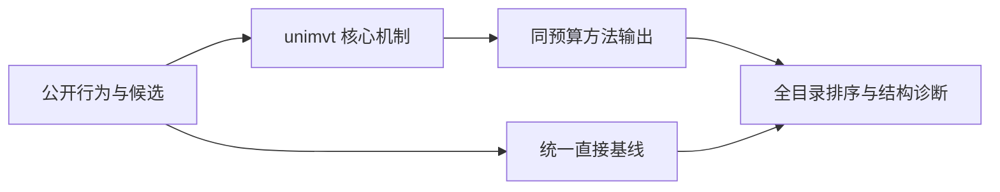
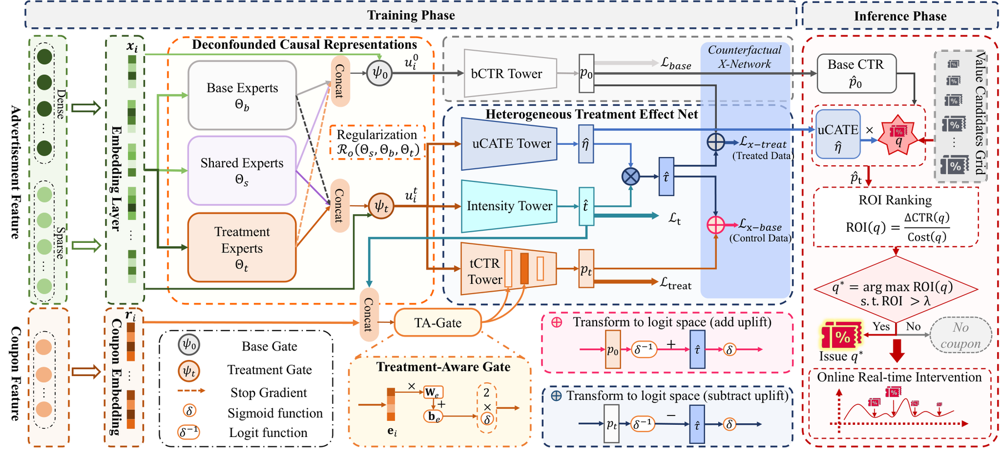

# UniMVT：去偏 CTR 与优惠券增量联合建模

> **Fidelity: 核心机制复现**。本地代码执行论文最有辨识度、可由公开数据验证的机制；私有数据、生产模型与服务栈明确列为边界。

## 论文信息

| 项目 | 内容 |
| --- | --- |
| 论文链接 | [arXiv 2602.12972](https://arxiv.org/abs/2602.12972) |
| 公司/机构 | Kuaishou Technology（按第一作者所属机构聚合） |
| 首次公开日期 | 2026-02-13（arXiv v1） |
| 原文开源代码 | 否：未找到原作者公开代码（核查日期：2026-09-05） |
| Adapter | `unimvt` |
| 本地复现代码 | [`src/auto_research/reproductions/unimvt/`](https://github.com/daiwk/auto-research/tree/main/src/auto_research/reproductions/unimvt/) |

## 原始论文总结

### 背景与主要改动

用去混杂表示把基础点击倾向与券强度敏感性分开，再由双预测塔和反事实 X-Network 约束事实/反事实结果；单元 uplift 将不同券档的增量统一到可比较尺度。



<!-- paper-figure:start -->
### 原论文关键图

[](https://arxiv.org/html/2602.12972v2/main_0514.png)

> **原论文 Figure 2（关键图）**：展示原论文方法的总体设计和关键组成。图片来自[原论文](https://arxiv.org/abs/2602.12972)，版权归原作者所有；点击图片可查看来源。
<!-- paper-figure:end -->

### 核心公式

$$
\hat\tau(x,t)=\hat p_t(x,t)-\hat p_0(x),\qquad \mathcal L=\mathcal L_{base}+\mathcal L_{treat}+\lambda\mathcal L_{cf}.
$$

### 论文离线与线上效果

- 论文在快手 10% 生产流量上报告优惠券收入 +18.14%、ROI +8.80，券场景 PCOC 误差降低 86.51%。
- 上述数字只复述论文证据，不写入本地公开数据效果结论。

## 本地复现

> **本地对照口径**：同一 MovieLens 全目录协议下，基线 NDCG@10 为 `0.05401`，实验组为 `0.03955`，相对变化 **-26.76%**。本地代理目标与论文生产任务不同，不能外推线上 lift。

三随机种子的完整结果、均值、标准差与 95% CI 见：

- [`metrics/public-seeds42-44.json`](metrics/public-seeds42-44.json)

```bash
auto-research reproduce --paper unimvt --dataset-dir data --seeds 42,43,44
```

## 复现边界

本地使用 MovieLens 100K 的固定公开子集及可审计代理目标，只验证中心计算机制；不复现原论文的私有日志、生产基础模型、线上分桶和 serving 栈。因此本页不宣称复现原文绝对指标或线上增益。
