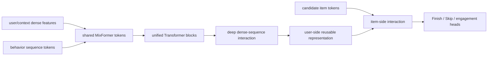

# MixFormer: Unified dense and sequence scaling

> **Fidelity: 完整核心链路复现**。当前代码在 matched local budget 下实际训练 stacked baseline 与 unified MixFormer blocks；proposed 将 dense feature-split tokens 和行为 tokens 放进共享 backbone，并复用 user encoding 对所有候选打分。

## 论文信息

| 项目 | 内容 |
| --- | --- |
| 论文链接 | [arXiv 2602.14110](https://arxiv.org/abs/2602.14110) |
| 公司/机构 | ByteDance / Douyin |
| 首次公开日期 | 2026-02-15（arXiv v1） |
| 原文开源代码 | 否：论文未提供官方/作者代码（核查日期：2026-07-22） |
| Adapter | `mixformer` |
| 本地复现代码 | [`src/auto_research/reproductions/mixformer/`](https://github.com/daiwk/auto-research/tree/main/src/auto_research/reproductions/mixformer/) |

## 原始论文总结

### 背景与主要改动

现有推荐模型通常把 dense feature interaction 与 behavior-sequence Transformer 做成两个独立模块，模型预算必须在两边手工分配，且交互只发生在末端。MixFormer 将非序列字段和行为序列统一成同一 Transformer token space，共享参数、逐层发生高阶交互，从而联合扩大 dense capacity 与 sequence length。工程上再把 user-side 与 candidate-item-side 计算解耦，对同一 request 的多个候选复用 user 表示。



### 核心公式

可把统一层抽象为 dense token $D^l$ 与 sequence token $S^l$ 的联合 attention：

$$
[D^{l+1};S^{l+1}]=Transformer_l([D^l;S^l]),
$$

而 stacked baseline 是两个独立参数化模块 $f_D(D)$、$f_S(S)$ 到末端才融合。User-item decoupling 将

$$
score(u,i)=h([z_u,z_i])
$$

拆为可跨候选复用的 $z_u=f_{user}(u,S_u)$ 与轻量 item interaction，降低 request-level 重复 FLOPs。

### 论文离线与线上效果

Douyin 两周、trillion-scale 交互数据上，MixFormer-medium 相对 base 的 Finish AUC/UAUC 为 +1.28%/+1.60%，Skip 为 +1.60%/+2.46%；user-item decoupling 在同等质量下降低约 36% FLOPs，serving 加速超过 30%。两周线上 A/B 全部显著：

| App | Active day | Duration | Like | Finish | Comment |
|---|---:|---:|---:|---:|---:|
| Douyin | +0.0415% | +0.2799% | +0.1766% | +0.3897% | +0.7035% |
| Douyin Lite | +0.0252% | +0.4105% | +0.2125% | +0.2924% | +1.9097% |

## 本地复现

> **本地对照口径**：基线是参数量匹配的 Stacked Dense+Sequence；实验组是 Unified MixFormer；NDCG@10 从 0.0054 升至 0.0063（**+17.41%**）。这是 stacked→unified 架构消融，不是相对 DIN。

MovieLens-100K genre 替代 300+ 私有 dense fields。stacked baseline 使用独立 sequence Transformer 与 dense MLP，末端融合；unified 模型把 dense columns 切成 4 个 feature-head tokens，与最近 32 个 behavior tokens 一起通过相同的 2-layer Transformer。两者参数量分别为 223,424 与 216,576，避免用更大参数量解释结果。统一模型的 user encoding 只计算一次，再与所有 candidate item vector 点积。

| Architecture | Hit@10 | NDCG@10 |
|---|---:|---:|
| Stacked dense + sequence | 0.0114 ± 0.0010 | 0.0054 ± 0.0009 |
| Unified MixFormer | **0.0118 ± 0.0030** | **0.0063 ± 0.0017** |

三个 seed、每模型 240 step 下，NDCG@10 相对提升 **17.41%**。绝对准确率较低，而且 proposed 的标准差更大，因此只能认为 unified interaction 在这个小规模设置中方向为正，不能声称稳定复现论文线上幅度。旧 semantic-gate proxy `+0.53%` 已撤回。

结构化指标见 [`metrics/movielens-100k-seed42.json`](metrics/movielens-100k-seed42.json)。完整运行：

```bash
pip install -e '.[neural-recs]'
auto-research reproduce --paper mixformer --dataset-dir data --seed 42
```

原始运行目录只保存在被 Git 忽略的 `runs/`；MR 只提交代码、测试、文档与脱敏指标。
