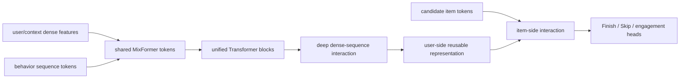

# MixFormer: Unified dense and sequence scaling

- 论文：[arXiv 2602.14110](https://arxiv.org/abs/2602.14110)，ByteDance / Douyin
- Adapter：`mixformer`；代码：`src/auto_research/reproductions/mixformer/`
- 本地数据：MovieLens-100K；运行：`auto-research reproduce --paper mixformer --seed 42`

## 原始论文总结

### 背景与主要改动

现有推荐模型通常把 dense feature interaction 与 behavior-sequence Transformer 做成两个独立模块，模型预算必须在两边手工分配，且交互只发生在末端。MixFormer 将非序列字段和行为序列统一成同一 Transformer token space，共享参数、逐层发生高阶交互，从而联合扩大 dense capacity 与 sequence length。工程上再把 user-side 与 candidate-item-side 计算解耦，对同一 request 的多个候选复用 user 表示。

### 核心公式

可把统一层抽象为 dense token $D^l$ 与 sequence token $S^l$ 的联合 attention：

$$[D^{l+1};S^{l+1}]=Transformer_l([D^l;S^l]),$$

而 stacked baseline 是两个独立参数化模块 $f_D(D)$、$f_S(S)$ 到末端才融合。User-item decoupling 将

$$score(u,i)=h([z_u,z_i])$$

拆为可跨候选复用的 $z_u=f_{user}(u,S_u)$ 与轻量 item interaction，降低 request-level 重复 FLOPs。

### 论文离线与线上效果

Douyin 两周、trillion-scale 交互数据上，MixFormer-medium 相对 base 的 Finish AUC/UAUC 为 +1.28%/+1.60%，Skip 为 +1.60%/+2.46%；user-item decoupling 在同等质量下降低约 36% FLOPs，serving 加速超过 30%。两周线上 A/B 全部显著：

| App | Active day | Duration | Like | Finish | Comment |
|---|---:|---:|---:|---:|---:|
| Douyin | +0.0415% | +0.2799% | +0.1766% | +0.3897% | +0.7035% |
| Douyin Lite | +0.0252% | +0.4105% | +0.2125% | +0.2924% | +1.9097% |

## 本地复现

MovieLens genre 代理 300+ 私有 dense features；baseline 为后融合 stacked scorer，MixFormer proxy 让 dense semantic gate 直接调制每个 sequence token 和 candidate score。三个 seed，cross weight 只由 validation 选择。

| Architecture | Hit@10 | NDCG@10 |
|---|---:|---:|
| Stacked dense + sequence | 0.0701 ± 0.0058 | 0.0346 ± 0.0025 |
| Unified MixFormer proxy | **0.0715 ± 0.0035** | **0.0348 ± 0.0011** |

NDCG@10 **+0.53%**，同样小于跨 seed 波动，不能声称稳定增益。统一交互机制已实现，但 trillion-scale 数据、1B+ backbone 与 user-item serving 解耦只记录为未复现边界。
