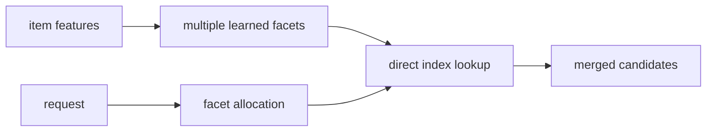
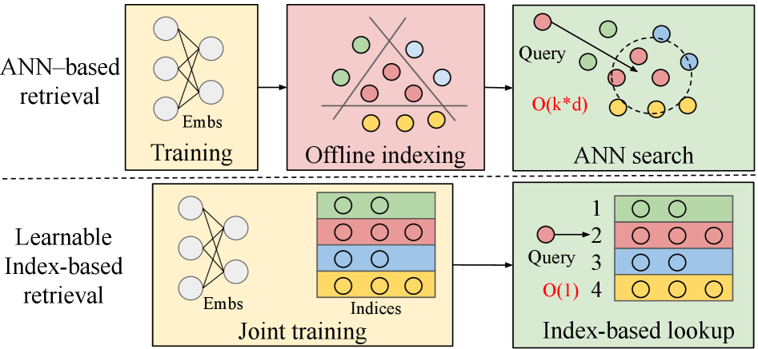

# MFLI：面向大规模推荐的多切面可学习索引

> **Fidelity: 核心机制复现**。本地构建并学习 genre、两层 semantic code、freshness 四个 facet，而非用单一 ANN 空间代替论文方法。

## 论文信息

| 项目 | 内容 |
| --- | --- |
| 论文链接 | [arXiv 2602.16124](https://arxiv.org/abs/2602.16124) |
| 公司/机构 | Meta |
| 首次公开日期 | 2026-02-18（arXiv v1） |
| 原文开源代码 | 否：论文未提供官方/作者代码（核查日期：2026-08-09） |
| Adapter | `mfli` |
| 本地复现代码 | [`src/auto_research/reproductions/mfli/`](https://github.com/daiwk/auto-research/tree/main/src/auto_research/reproductions/mfli/) |

## 原始论文总结

### 背景与主要改动

ANN 把所有召回目标压进一个几何空间，离线建索引导致新内容滞后，在线近邻搜索又随候选规模变贵。MFLI 将 index 作为模型参数联合学习，并用多个 facet 表达语义、受欢迎度和时效性；请求侧直接分配各 facet 的检索预算。



<!-- paper-figure:start -->
### 原论文关键图

[](https://arxiv.org/html/2602.16124v1#S1.F1)

> 原论文 Figure 1：传统 ANN 三阶段与联合学习索引的对比。图片来自[原论文](https://arxiv.org/abs/2602.16124)，版权归原作者所有。
<!-- paper-figure:end -->

### 核心公式

对 facet $m$ 的 code $c_m(i)$，请求动态分配 $a_m(q)$：

$$
s(q,i)=\sum_m a_m(q)\,P_m\!\left(c_m(i)\mid c_m(q)\right),\quad a(q)=\operatorname{softmax}(g(q)).
$$

### 论文离线与线上效果

- 7 天 A/B：低 VV 内容曝光 `+279%`，中 VV `+54%`，头部 `-2%`。
- ultra-fresh `+221%`、same-day `+10%`，显式互动 `+0.08%`、多样性 `+0.30%`、QPS `+60%`。

## 本地复现

> **本地对照口径**：基线为同切分的 single-space ANN proxy，实验组加入四 facet MFLI；NDCG@10 相对 `-10.01%`。

与 single-space ANN proxy 相比，Hit@10 持平，NDCG@10 `-10.01%`，head share `+9.94%`；公开小数据上的 facet 分配没有重现论文的去头部效果，按原样记录。

指标见 [`metrics/movielens-100k-seed42.json`](metrics/movielens-100k-seed42.json)。

```bash
auto-research reproduce --paper mfli --dataset-dir data --seed 42
```

## 复现边界

全目录打分用于公平实验，不测 Meta 的十亿级实时索引、GPU QPS 或私有新鲜度标签。
