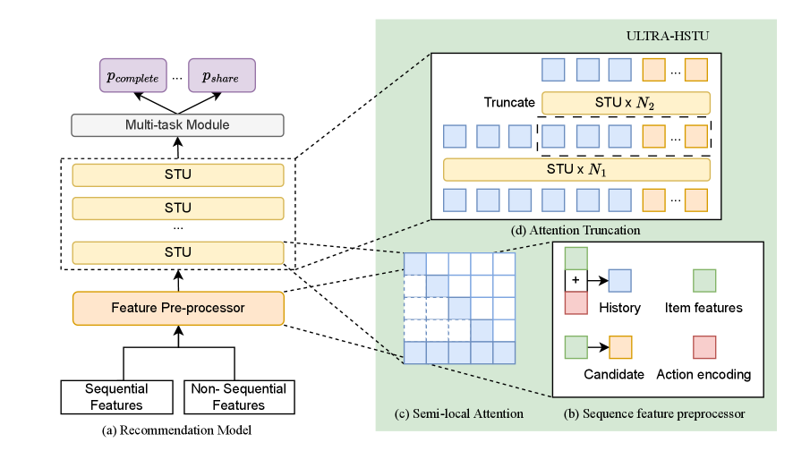

# ULTRA-HSTU：弯折大规模推荐的 scaling-law 曲线

> **Fidelity: 核心机制复现**。本地执行 semi-local attention、LBSL 逐层扩窗与 Mixture of Transducers。

## 论文信息

| 项目 | 内容 |
| --- | --- |
| 论文链接 | [arXiv 2602.16986](https://arxiv.org/abs/2602.16986) |
| 公司/机构 | Meta |
| 首次公开日期 | 2026-02-19（arXiv v1） |
| 原文开源代码 | 否：论文未提供官方/作者代码（核查日期：2026-08-09） |
| Adapter | `ultra-hstu` |
| 本地复现代码 | [`src/auto_research/reproductions/ultra_hstu/`](https://github.com/daiwk/auto-research/tree/main/src/auto_research/reproductions/ultra_hstu/) |

## 原始论文总结

### 背景与主要改动

原始 HSTU 扩展到 16k 行为和更深网络时，attention 与内存成本成为瓶颈。ULTRA-HSTU 用 semi-local attention 保留局部 token 和少量 landmark，LBSL 令越深层看到越宽范围，再以 Mixture of Transducers、attention truncation、混合精度和动态拓扑共同提升训练与推理斜率。


<!-- paper-figure:start -->
### 原论文关键图

[](https://arxiv.org/html/2602.16986v2)

> 原论文结构图：ULTRA-HSTU 的核心模型改造。图片来自[原论文](https://arxiv.org/abs/2602.16986)，版权归原作者所有。
<!-- paper-figure:end -->

### 核心公式

第 $l$ 层只连接局部窗口与分块 landmark，LBSL 令窗口随深度扩大：

$$
\mathcal N_l(t)=\{t-w,\ldots,t\}\cup\mathcal B_l,\qquad w_l=w_0(l+1),
$$

$$
h_{l+1}=h_l+\sum_e \operatorname{softmax}(r(h_l))_eT_e(\operatorname{Attn}_{\mathcal N_l}(h_l)).
$$

### 论文离线与线上效果

- 多组严格 30 天 A/B，面向数十亿日活全量部署：consumption `+4.11%`，engagement `+2%~+8%`。
- topline `+0.05% / +0.01%`；训练 scaling efficiency `5×`，推理 `21×`。

## 本地复现

> **本地对照口径**：基线为 short-history transition-content ranker，实验组执行 ULTRA-HSTU compact core；NDCG@10 相对 `-0.95%`。

六层、8-token 局部窗口与逐层 broad summary。相对同协议基线 Hit@10 `+8.33%`、NDCG@10 `-0.95%`、fresh Hit@10 `+50%`、head share `-13.38%`；没有把单 seed Hit 改善解释为稳定质量提升。

指标见 [`metrics/movielens-100k-seed42.json`](metrics/movielens-100k-seed42.json)。

```bash
auto-research reproduce --paper ultra-hstu --dataset-dir data --seed 42
```

## 复现边界

48-event 序列替代 16k 历史；不复刻 18 层生产模型、动态 topology、FP8 kernel 或 Meta 私有日志。
